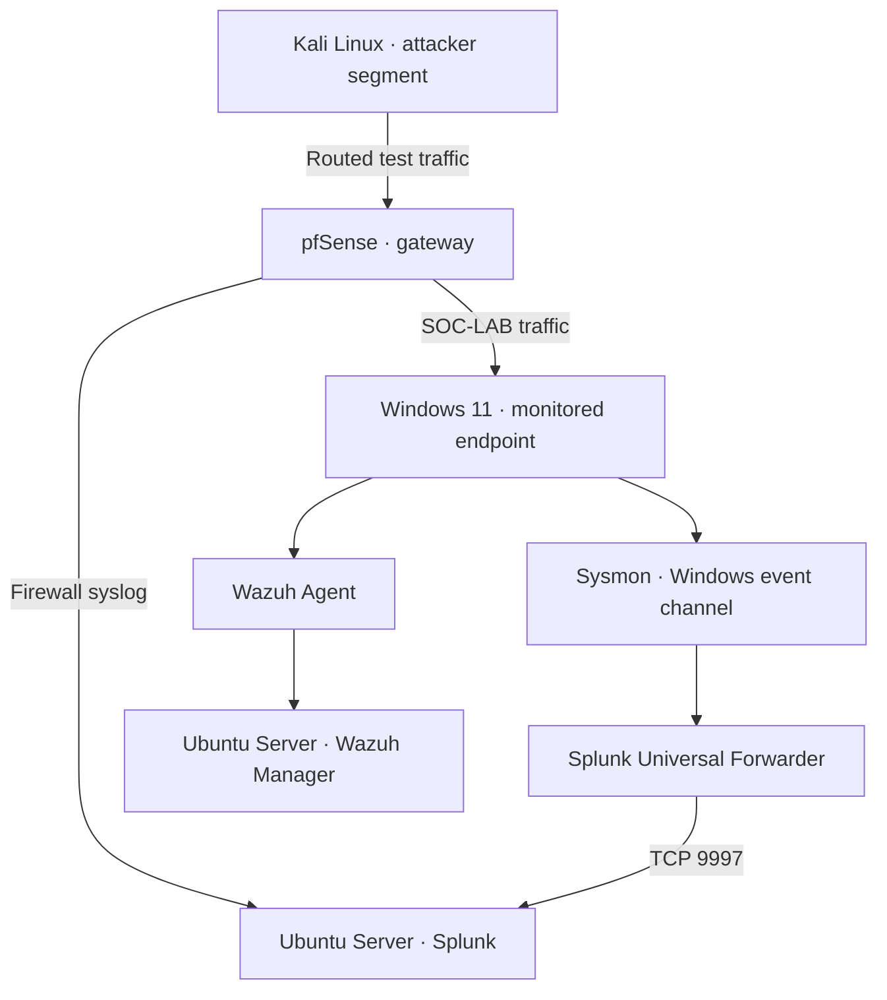

# SOC SIEM Home Lab

**Endpoint and firewall monitoring with Splunk, Wazuh, pfSense and Sysmon**

A personal SOC practice project by **xFcyber**, built in Oracle VirtualBox with Windows 11, two Ubuntu Server machines and Kali Linux. The focus is tracing an event from its source through log collection, detection and analyst investigation.

## Project status

This repository documents the lab previously built by the author. It separates previously reported observations from new query examples and work awaiting evidence. It does not claim production experience.

| Component / activity | Status |
| --- | --- |
| VirtualBox environment and pfSense gateway | Five lab VMs shown Running on 2026-10-07 |
| Windows 11 with Sysmon | Installed; process creation events previously observed |
| Universal Forwarder → Splunk on TCP 9997 | Previously confirmed active |
| pfSense filterlog → Splunk | Raw and parsed event screenshots attached |
| Wazuh manager and Windows agent | Active windows-lab agent 001 shown in dashboard screenshot |
| Controlled Kali port scan | Previously performed; firewall events reviewed |
| Revised port scan SPL in this repository | Prepared; requires execution against actual lab logs |
| Scheduled alert definition | Saved and enabled in screenshot; no fired events displayed |
| Wazuh event and alert comparison | Pending evidence |
| Security / System / Application forwarding, AD and additional detections | Planned or awaiting ingestion checks |

Eight original screenshots are included in the [evidence gallery](screenshots/README.md): the five running lab VMs, Windows and Kali IP/time settings, raw and parsed firewall events, a saved alert, an OPT1 rule draft and an active Wazuh endpoint. Raw event exports, the Kali command and a successful scheduled trigger remain pending.

## Environment baseline

The screenshot from 2026-10-07 shows Splunk-Server, Windows 11, pfSense-Firewall, Ubuntu-22,04 Server (Wazuh) and kali-linux-2024.2 in the SOC-LAB group, all marked Running. This establishes VM power state; service health, current IP addresses and clock synchronization are checked separately.

## Architecture

Kali can be moved between segments for different exercises. For the firewall case, use the attacker segment so traffic crosses pfSense. Same-subnet traffic can bypass the firewall.

[Addressing and routing](architecture/architecture.md) · [Windows network/time baseline](architecture/windows-baseline.md) · [Kali route/time baseline](architecture/kali-baseline.md) · [Telemetry coverage](architecture/data-sources.md)

## Technology and purpose

| Technology | Role |
| --- | --- |
| VirtualBox | Hosts the practice environment |
| pfSense | Routes lab traffic and generates firewall logs |
| Windows 11 | Monitored endpoint |
| Sysmon | Endpoint activity telemetry |
| Splunk Universal Forwarder | Sends selected Windows event channels to Splunk |
| Splunk Enterprise on Ubuntu Server | Search and analysis of collected events |
| Wazuh manager on Ubuntu Server / Windows agent | Separate endpoint monitoring path |
| Kali Linux | Authorized event generation in the lab |

## Explore the project

| Area | Documentation |
| --- | --- |
| Architecture | [Topology](architecture/architecture.md), [data sources](architecture/data-sources.md) |
| Splunk | [Setup and validation](splunk/setup.md), [searches](splunk/spl-searches.md), [alerts](splunk/alerts.md) |
| Wazuh | [Setup checks](wazuh/setup.md), [agent collection](wazuh/agent-configuration.md) |
| pfSense | [Interfaces and rules](pfsense/configuration.md), [syslog](pfsense/syslog-forwarding.md) |
| Windows | [Sysmon](windows-endpoint/sysmon.md), [forwarder](windows-endpoint/splunk-universal-forwarder.md), [Wazuh agent](windows-endpoint/wazuh-agent.md) |
| Simulation | [Controlled port scan](attack-simulations/port-scan.md) |
| Detection | [Port scan analytic](detections/port-scan-detection.md), [SPL file](detections/pfsense-ipv4-port-scan.spl) |
| Investigation | [Screenshot-backed case 001](investigations/incident-001-port-scan.md), [case template](investigations/incident-template.md) |
| Portfolio evidence | [Screenshot checklist](screenshots/README.md) |

## First case: Kali → pfSense → Splunk

The initial case investigates connections to multiple destination ports on a lab target. The analytic groups by **source and destination IP**, counts distinct destination ports within a five-minute search window, and returns candidates at a lab threshold of five ports.

A result indicates scan-like behavior; authorization and event context determine the verdict. A firewall log does not prove successful access or endpoint compromise.

[Read the detection](detections/port-scan-detection.md) and [the evidence-backed investigation](investigations/incident-001-port-scan.md).

The captured raw search shows pfSense events from 192.168.20.100 to 192.168.10.100, received through udp:5514. The case documents timestamp discrepancies and the limits of the visible results.

The captured Wazuh page shows windows-lab (001) active. See the [agent inventory](wazuh/agent-configuration.md) for details and remaining collection checks.

## Skills practiced

Log collection, SPL search, firewall log interpretation, endpoint telemetry validation, alert triage, evidence handling and investigation documentation. A proposed MITRE ATT&CK association for the scan is **T1046 — Network Service Discovery**; this is a technique reference, not proof of a malicious incident.

## Roadmap

Validate the revised SPL against live events, add the Kali command and individual endpoint event details, verify scheduled firing, then add failed authentication and PowerShell investigations. Active Directory and Windows Server remain future additions.

## Scope and author

Exercises are restricted to systems owned or authorized by the author inside the lab. Public documentation should exclude credentials, enrollment keys and personal or unrelated network data.

**xFcyber** · Cybersecurity / SOC learning portfolio

[Technical references](docs/references.md)

