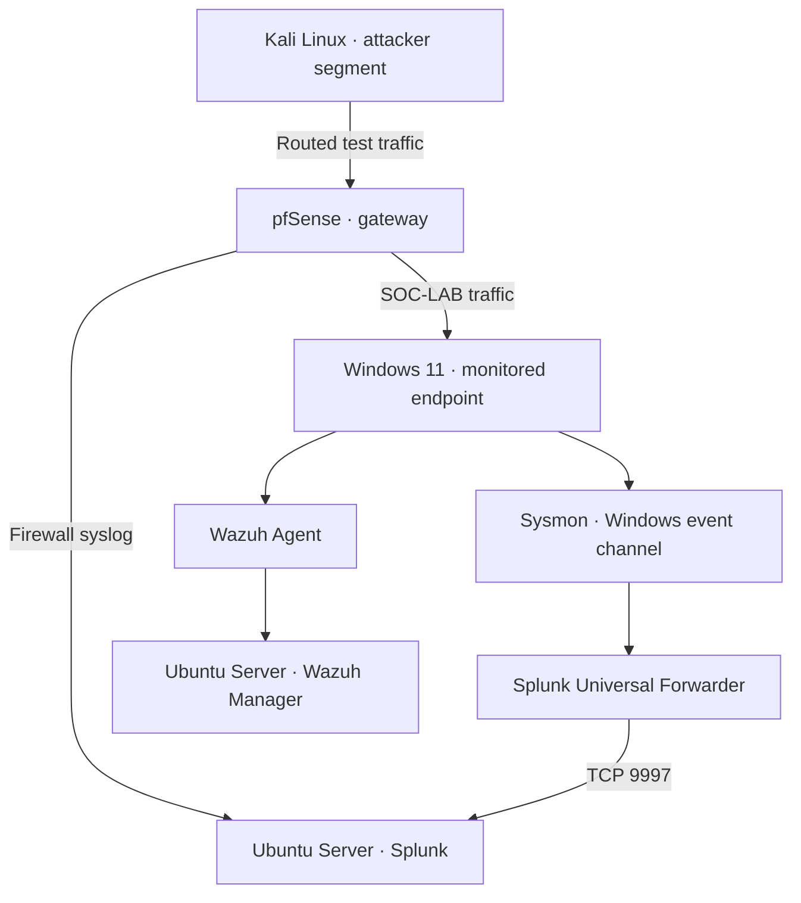

# SOC SIEM Home Lab

**Endpoint and firewall monitoring with Splunk, Wazuh, pfSense and Sysmon**

A personal SOC practice project by **xFcyber**, built in Oracle VirtualBox with Windows 11, two Ubuntu Server machines and Kali Linux. The focus is tracing an event from its source through log collection, detection and analyst investigation.

## Project status

This repository documents the lab previously built by the author. It separates previously reported observations from new query examples and work awaiting evidence. It does not claim production experience.

| Component / activity | Status |
| --- | --- |
| VirtualBox environment and pfSense gateway | Five lab VMs shown Running on 2026-10-07 |
| Windows 11 with Sysmon | Installed; process creation events previously observed |
| Universal Forwarder → Splunk on TCP 9997 | Previously confirmed active |
| pfSense filterlog → Splunk | Raw/parsed screenshots and a 2026-10-07 search returning indexed filterlog records |
| Wazuh manager and Windows agent | Active windows-lab agent 001 shown in dashboard screenshot |
| Controlled Kali port scan | Eight-port SYN scan, matching firewall records and one grouped detection result confirmed |
| Revised port scan SPL in this repository | Core extraction, grouping and threshold validated in case 002 manual replay |
| Port-scan scheduled alert | Historical replay confirmed. A fresh eight-port scan completed on 2026-10-10 at 11:28:25 +03:00; updated relative-window settings, fresh firewall correlation and scheduled results pending |
| Controlled SMB failed-logon exercise | Five failed logons from Kali correlated across Windows Security and pfSense; manual Splunk detection confirmed |
| Windows Security forwarding | Confirmed in `security_logs` with XML-rendered Security events |
| Brute-force alert | `SOC-002 - Brute Force Failed Logon Detection` fired at 2026-10-09 17:50:01 UTC; scheduled View Results confirms 5 failures and one grouped result |
| Suspicious PowerShell execution | Sysmon Event ID 1 detection tuned and validated; `SOC-003 - Suspicious PowerShell Encoded Execution` fired successfully |
| Scheduled Task persistence | Windows Security 4698 plus Sysmon process correlation validated; `SOC-004 - Suspicious Scheduled Task Creation` fired successfully |
| Ransomware-like mass file activity | Windows Security 4663 burst detection validated; `SOC-005 - Possible Ransomware Mass File Activity` fired successfully at high severity |
| Wazuh event and alert comparison | Pending evidence |
| System / Application forwarding, AD and additional detections | Indexes configured or planned; additional ingestion evidence pending |

**67 PNG files** (63 original screenshots and four cropped evidence views) are attached across the [evidence gallery](screenshots/README.md) and the investigations. They cover the lab baseline and all five controlled attack scenarios, including execution, indexed telemetry, detection results and the captured scheduled triggers. A [five-row raw Windows Security CSV](investigations/evidence/soc-002-4625-events-20261009.csv) is attached for the SOC-002 retest; raw exports for other exercises remain pending. Trigger History and scheduled View Results are now captured for all five scenarios. The port-scan job is a **historical replay with fixed 2026-10-07 bounds**, so fresh-event detection still requires verification of the relative-window correction and correlation with the newly completed 2026-10-10 scan.

## Five documented attack scenarios

| Scenario | Investigation | Detection evidence | Scheduled alert evidence |
| --- | --- | --- | --- |
| TCP port scan | [Case 002](investigations/incident-002-controlled-port-scan.md) | Historical 8-port / 8-event correlation; fresh 2026-10-10 Nmap run completed with 3 open / 5 closed ports | Historical replay confirmed; fresh telemetry and relative-window scheduled results pending |
| SMB failed logons / brute-force behavior | [Case 003](investigations/incident-003-brute-force.md) | 5 failed logons, Security 4625, TCP 445 correlation | Trigger History + scheduled View Results confirmed on 2026-10-09 |
| Suspicious encoded PowerShell | [Case 004](investigations/incident-004-suspicious-powershell.md) | Sysmon Event ID 1 and tuned command-line logic | Trigger History + View Results confirmed |
| Scheduled Task persistence | [Case 005](investigations/incident-005-scheduled-task.md) | Security 4698 plus Sysmon process correlation | Trigger History + View Results confirmed |
| Ransomware-like mass file activity | [Case 006](investigations/incident-006-ransomware-like-file-activity.md) | Security 4663, 20-file manual batch / 15-file validation batch | High-severity Trigger History + View Results confirmed |

These are authorized lab simulations. The ransomware-like case uses harmless marker files and does not perform encryption.

## Environment baseline

The screenshot from 2026-10-07 shows Splunk-Server, Windows 11, pfSense-Firewall, Ubuntu-22,04 Server (Wazuh) and kali-linux-2024.2 in the SOC-LAB group, all marked Running. This establishes VM power state; service health, current IP addresses and clock synchronization are checked separately.

## Architecture

Kali can be moved between segments for different exercises. For the firewall case, use the attacker segment so traffic crosses pfSense. Same-subnet traffic can bypass the firewall.

[Addressing and routing](architecture/architecture.md) · [Windows network/time baseline](architecture/windows-baseline.md) · [Kali route/time baseline](architecture/kali-baseline.md) · [Splunk address/startup baseline](architecture/splunk-baseline.md) · [Telemetry coverage](architecture/data-sources.md)

## Technology and purpose

| Technology | Role |
| --- | --- |
| VirtualBox | Hosts the practice environment |
| pfSense | Routes lab traffic and generates firewall logs |
| Windows 11 | Monitored endpoint |
| Sysmon | Endpoint activity telemetry |
| Splunk Universal Forwarder | Sends selected Windows event channels to Splunk |
| Splunk Enterprise on Ubuntu Server | Search and analysis of collected events |
| Wazuh manager on Ubuntu Server / Windows agent | Separate endpoint monitoring path |
| Kali Linux | Authorized event generation in the lab |

## Explore the project

| Area | Documentation |
| --- | --- |
| Architecture | [Topology](architecture/architecture.md), [data sources](architecture/data-sources.md) |
| Splunk | [Setup and validation](splunk/setup.md), [searches](splunk/spl-searches.md), [alerts](splunk/alerts.md) |
| Wazuh | [Setup checks](wazuh/setup.md), [agent collection](wazuh/agent-configuration.md) |
| pfSense | [Interfaces and rules](pfsense/configuration.md), [syslog](pfsense/syslog-forwarding.md) |
| Windows | [Sysmon](windows-endpoint/sysmon.md), [forwarder](windows-endpoint/splunk-universal-forwarder.md), [Wazuh agent](windows-endpoint/wazuh-agent.md) |
| Simulation | [Controlled port scan](attack-simulations/port-scan.md), [controlled SMB failed logons](attack-simulations/brute-force.md), [controlled suspicious PowerShell](attack-simulations/powershell.md), [controlled Scheduled Task persistence](attack-simulations/scheduled-task.md), [controlled ransomware-like file activity](attack-simulations/ransomware-like-file-activity.md) |
| Detection | [Port scan analytic](detections/port-scan-detection.md), [port-scan SPL](detections/pfsense-ipv4-port-scan.spl), [Windows brute-force analytic](detections/windows-brute-force-detection.md), [brute-force SPL](detections/windows-brute-force.spl), [PowerShell analytic](detections/suspicious-powershell-detection.md), [PowerShell SPL](detections/suspicious-powershell.spl), [Scheduled Task analytic](detections/scheduled-task-detection.md), [Scheduled Task SPL](detections/scheduled-task-creation.spl), [Ransomware-like analytic](detections/ransomware-mass-file-activity.md), [Ransomware-like SPL](detections/ransomware-mass-file-activity.spl) |
| Investigation | [Historical case 001](investigations/incident-001-port-scan.md), [controlled scan case 002](investigations/incident-002-controlled-port-scan.md), [brute-force case 003](investigations/incident-003-brute-force.md), [PowerShell case 004](investigations/incident-004-suspicious-powershell.md), [Scheduled Task case 005](investigations/incident-005-scheduled-task.md), [Ransomware-like case 006](investigations/incident-006-ransomware-like-file-activity.md), [case template](investigations/incident-template.md) |
| Portfolio evidence | [Screenshots and raw event exports](screenshots/README.md) |

## First case: Kali → pfSense → Splunk

The initial case investigates connections to multiple destination ports on a lab target. The analytic groups by **source and destination IP**, counts distinct destination ports within a five-minute search window, and returns candidates at a lab threshold of five ports.

A result indicates scan-like behavior; authorization and event context determine the verdict. A firewall log does not prove successful access or endpoint compromise.

[Read the detection](detections/port-scan-detection.md) and [the evidence-backed investigation](investigations/incident-001-port-scan.md).

The captured raw search shows pfSense events from 192.168.20.100 to 192.168.10.100, received through udp:5514. The case documents timestamp discrepancies and the limits of the visible results.

The captured Wazuh page shows windows-lab (001) active. See the [agent inventory](wazuh/agent-configuration.md) for details and remaining collection checks.

## Current exercise: controlled scan — 2026-10-07

An actual Nmap run scanned eight TCP ports on Windows 192.168.10.100 at 15:54 UTC+03:00. Ports 135, 139 and 445 were reported open; the other five were closed. The command and completed output are attached. Eight indexed TCP SYN records match the scanner, target and all eight ports, with firewall action pass. The manual analytic replay returns one candidate with eight distinct ports and eight events. This is an authorized-test true positive for scan behavior. A separate 2026-10-09 capture shows the enabled `SOC Lab - IPv4 TCP Port Scan` alert with repeated Trigger History entries, most recently **18:30:02 UTC (21:30:02 Asia/Riyadh)**. The captured scheduler job for that firing uses `earliest=1791377520 latest=1791377820` and returns **8 events / 1 grouped result** over **2026-10-07 12:52–12:57 UTC**, matching the old scan's source, target and eight-port set. Fixed replay bounds explain how unchanged historical events can trigger repeatedly; this does not establish a new scan. Updating the saved alert to a relative window and validating a fresh test remain pending.

A fresh retest attempted at **2026-10-10 11:22:49–11:22:52 +03:00** stopped with **failed to determine route to 192.168.10.100** and **0 hosts scanned**. The [user-submitted terminal transcript](investigations/evidence/port-scan-retest-20261010-submitted-terminal.txt) is attached. That attempt did not establish a completed scan or fresh scheduled validation. A later original screenshot captures a successful rerun at **11:28:25 +03:00 (08:28:25 UTC)**, with **1 IP address scanned in 0.20 seconds**, ports **135, 139 and 445 open**, and the other five closed. The network change that enabled the rerun is not shown; fresh firewall logs, saved-alert correction and scheduled results remain pending.

[Follow case 002](investigations/incident-002-controlled-port-scan.md).

## Current exercise: controlled SMB failed logons — 2026-10-08–09

A dedicated lab account received five intentionally incorrect SMB authentication attempts from Kali **192.168.20.20** to Windows **192.168.10.100**. Windows generated Event ID **4625** records, and a Splunk aggregation returned one candidate with **5 failures**, **TargetUserName=SOC-Test**, **Workstation=KALI** and **LogonType=3**. pfSense independently recorded inbound TCP traffic from the same source to the target on **TCP 445**. A follow-up Event ID 4624 search returned **0 successful logons from the Kali address in the checked one-hour window**.

The behavior is documented as an authorized-test true positive for **T1110 — Brute Force**. The original 4624 follow-up window starts after the failed-logon batch, so complete successful-logon coverage remains pending.

A fresh five-attempt test on **2026-10-09** caused `SOC-002 - Brute Force Failed Logon Detection` to fire at **17:50:01 UTC (20:50:01 Asia/Riyadh)**. The scheduled **View Results** job covers **17:45–17:50 as displayed by Splunk** and returns **5 events / 1 grouped result**, matching Kali **192.168.20.20**, **SOC-Test**, **KALI** and **LogonType=3**. The execution, Trigger History and scheduled-result screenshots are attached in case 003.

A captured successful-logon check for this fresh test returns **0 matching Event ID 4624 records** from **192.168.20.20** over **17:45:00–18:04:33 as displayed by Splunk**, covering time before, during and after the failed batch. This is a scoped negative search result; the original 2026-10-08 full-window check remains pending.

The [original raw CSV export](investigations/evidence/soc-002-4625-events-20261009.csv) contains **5 distinct Windows Security 4625 records**, IDs **78762–78766**, with **Status=0xc000006d** and **SubStatus=0xc000006a**. Its explicit UTC timestamps match the scheduled-result first/last times, and its embedded Windows XML is preserved.

[Follow case 003](investigations/incident-003-brute-force.md) · [Detection analytic](detections/windows-brute-force-detection.md).

## Current exercise: suspicious PowerShell execution — 2026-10-09

A safe PowerShell process was executed with `-NoProfile`, `-WindowStyle Hidden` and `-EncodedCommand`. Sysmon Event ID **1** captured the process, and Splunk received the event in `index=main`. A broad PowerShell search also surfaced legitimate Wazuh-related activity, so the analytic was tuned to require encoded execution together with a hidden window.

The scheduled alert `SOC-003 - Suspicious PowerShell Encoded Execution` was then validated end-to-end. Splunk Trigger History recorded a firing at **2026-10-09 09:20:03 UTC**, and **View Results** returned one matching event in the scheduled search window.

This exercise demonstrates both **detection engineering** and **false-positive reduction**, mapped to **MITRE ATT&CK T1059.001 — PowerShell**.

[Follow case 004](investigations/incident-004-suspicious-powershell.md) · [Detection analytic](detections/suspicious-powershell-detection.md).

## Current exercise: Scheduled Task persistence — 2026-10-09

Windows auditing for **Other Object Access Events** was enabled, then an authorized Scheduled Task was created and exercised. Windows Security produced Event ID **4698**, while Sysmon Event ID **1** captured both task-management activity and the task-launched `cmd.exe` process. The execution path showed `cmd.exe` with parent `svchost.exe`, consistent with Task Scheduler service execution context.

The scheduled Splunk alert `SOC-004 - Suspicious Scheduled Task Creation` was validated end-to-end. Trigger History recorded a firing at **2026-10-09 13:00:01 UTC**, and **View Results** returned the fresh validation task `\SOC-LAB-T1053-ALERT`.

This exercise maps to **MITRE ATT&CK T1053.005 — Scheduled Task/Job: Scheduled Task**.

[Follow case 005](investigations/incident-005-scheduled-task.md) · [Detection analytic](detections/scheduled-task-detection.md).

## Current exercise: ransomware-like mass file activity — 2026-10-09

A safe impact simulation created ransomware-like test files only inside `C:\Users\Public\SOC-RANSOMWARE-LAB`; no real data was encrypted or deleted. Because the active Sysmon configuration did not expose the required file-create events, Windows File System auditing was enabled only for the test directory. Windows Security Event ID **4663** then provided the required file-access telemetry.

The first audited batch produced **20 distinct files in one minute**, all correlated to Windows PowerShell. A high-severity scheduled Splunk alert named `SOC-005 - Possible Ransomware Mass File Activity` was created with a threshold of **10 unique files per minute**. A fresh 15-file validation batch caused the alert to fire at **2026-10-09 14:20:01 UTC**, and **View Results** returned **15 AccessEvents / 15 UniqueFiles**.

This exercise maps to **MITRE ATT&CK T1486 — Data Encrypted for Impact**, while clearly documenting that the lab used simulated extensions rather than real encryption.

[Follow case 006](investigations/incident-006-ransomware-like-file-activity.md) · [Detection analytic](detections/ransomware-mass-file-activity.md).

## Skills practiced

Log collection, SPL search, firewall log interpretation, endpoint telemetry validation, alert triage, evidence handling and investigation documentation. A proposed MITRE ATT&CK association for the scan is **T1046 — Network Service Discovery**; this is a technique reference, not proof of a malicious incident.

## Roadmap

Verify the port-scan alert's relative-window correction and actual cron/window settings, then correlate the completed 2026-10-10 scan with fresh firewall events and its scheduled job. Capture the network change behind the recovered scan route when available. Repeat the successful-logon check across the full original 2026-10-08 brute-force exercise window, and add raw event exports for the other exercises. Wazuh event comparisons, Active Directory and Windows Server remain future additions.

## Scope and author

Exercises are restricted to systems owned or authorized by the author inside the lab. Public documentation should exclude credentials, enrollment keys and personal or unrelated network data.

**xFcyber** · Cybersecurity / SOC learning portfolio

[Technical references](docs/references.md)

