# Case 003 — Controlled SMB brute-force / failed-logon investigation

**Status:** Controlled attack, endpoint evidence, firewall correlation, manual detection and scheduled firing confirmed. The fresh 2026-10-09 retest has captured Trigger History, scheduled View Results and a successful-logon check covering its failed batch.

## Executive summary

On 2026-10-08, Kali Linux at **192.168.20.20** generated five controlled failed SMB authentication attempts against the Windows 11 lab target **192.168.10.100** using the test account **SOC-Test**. Kali returned `NT_STATUS_LOGON_FAILURE`.

Windows Security auditing generated Event ID **4625** records. A Splunk analytic grouped five failures for the same source IP and target account, with **Workstation=KALI** and **LogonType=3 (Network)**. pfSense independently recorded TCP traffic from the same source to the same target on destination port **445**. A follow-up Splunk search found **0 Event ID 4624 successful logons from 192.168.20.20** during the checked one-hour window.

On **2026-10-09**, a fresh five-attempt SMB test reproduced the behavior. The scheduled alert fired at **17:50:01 UTC (20:50:01 Asia/Riyadh)**, and its scheduled job returned **5 events / 1 grouped result** for the same source and account. A subsequent search returned **0 matching Event ID 4624 records** from the Kali address over **17:45:00–18:04:33 as displayed by Splunk**, including the full fresh failed-logon batch.

**Verdict:** True positive for the controlled failed-authentication / brute-force behavior.  
**Disposition:** Authorized lab activity; unsuccessful authentication attempt.  
**Severity:** Medium for the lab scenario.  
**Observed impact:** Five failed authentications confirmed; no matching successful logon from the Kali address in the captured fresh-test window. Full-window coverage of the original 2026-10-08 test remains pending.  
**MITRE ATT&CK:** T1110 — Brute Force.

## Visual evidence

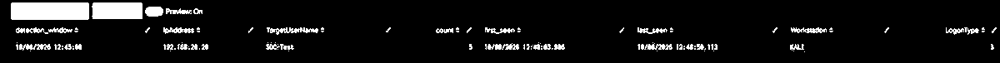

The PNG above is cropped from the captured lab screenshot so the key Splunk result remains readable directly inside the investigation.

## Scope

| Role | Observed value |
| --- | --- |
| Source | Kali Linux, 192.168.20.20 |
| Target | Windows 11, 192.168.10.100 |
| Target account | SOC-Test |
| Service | SMB / TCP 445 |
| Firewall | pfSense |
| SIEM | Splunk Enterprise |
| Windows log index | security_logs |
| Windows event | 4625 |
| Successful-logon check | 4624 |
| Detection threshold | 5 failures in 5 minutes |

The correct password for the test account is intentionally excluded from the repository.

## Evidence 1 — Controlled authentication failures

The exercise used five incorrect passwords against the dedicated lab account:

```bash
for pass in WrongPass1 WrongPass2 WrongPass3 WrongPass4 WrongPass5; do
    echo "Trying password: $pass"
    smbclient -L //192.168.10.100 -U "SOC-Test%$pass" -m SMB3
    sleep 2
done
```

The captured output returned `NT_STATUS_LOGON_FAILURE` for each attempted password. TCP 445 had been confirmed reachable before the run.

Windows account policy showed a lockout threshold of 10 attempts, so the test was limited to five.

## Evidence 2 — Windows Security Event ID 4625

Windows itself confirmed Event ID 4625 records after the test. Splunk also returned events when searching the XML-rendered Security channel.

A focused search for the controlled source, account and event returned the five relevant records:

```spl
index=security_logs "4625" "SOC-Test" "192.168.20.20"
```

The XML records exposed values including the target account, source address and network logon type.

## Evidence 3 — Detection aggregation

The validated analytic returned:

| Field | Result |
| --- | --- |
| Source IP | 192.168.20.20 |
| Target user | SOC-Test |
| Failed count | 5 |
| Workstation | KALI |
| Logon type | 3 |
| First seen | 2026-10-08 12:48:03.986 as displayed by Splunk |
| Last seen | 2026-10-08 12:48:50.113 as displayed by Splunk |

The executed validation preserved original event time before five-minute bucketing so first/last event timestamps remained visible.

See [the analytic](../detections/windows-brute-force-detection.md).

## Evidence 4 — Successful-login check

The investigation searched Event ID 4624 for the Kali address:

```spl
index=security_logs "<EventID>4624</EventID>"
| rex field=_raw "<Data Name='TargetUserName'>(?<TargetUserName>[^<]*)</Data>"
| rex field=_raw "<Data Name='IpAddress'>(?<IpAddress>[^<]*)</Data>"
| rex field=_raw "<Data Name='IpPort'>(?<IpPort>[^<]*)</Data>"
| rex field=_raw "<Data Name='LogonType'>(?<LogonType>[^<]*)</Data>"
| rex field=_raw "<Data Name='WorkstationName'>(?<WorkstationName>[^<]*)</Data>"
| search IpAddress="192.168.20.20"
| table _time TargetUserName IpAddress IpPort LogonType WorkstationName
| sort - _time
```

The captured search returned **0 events** for **2026-10-08 12:49:00–13:49:06**, as displayed by Splunk. This window starts after the failed-logon batch (**12:48:03.986–12:48:50.113**), so it is a follow-up check rather than complete coverage of the original attempt period. No successful logon was observed in the checked window. A new fixed-window search spanning before, during and after the attempts is still needed to cover that entire period; this result does not establish absence outside the searched window or through another source address.

## Evidence 5 — pfSense network correlation

pfSense filterlog independently recorded traffic from Kali to the Windows SMB service. A parsed Splunk view showed multiple inbound, passed TCP records with:

- `src_ip=192.168.20.20`
- `dst_ip=192.168.10.100`
- `dst_port=445`
- `protocol=tcp`
- `action=pass`
- `direction=in`

The review displayed seven firewall records around the exercise period. Firewall connection/log counts are not expected to equal Windows authentication-event counts one-for-one.

The parsing query used for the evidence view was:

```spl
index=pfsense "192.168.20.20" "192.168.10.100" "445"
| rex field=_raw "filterlog\[\d+\]:\s+(?<pfdata>.*)"
| eval f=split(pfdata,",")
| eval interface=mvindex(f,4)
| eval action=mvindex(f,6)
| eval direction=mvindex(f,7)
| eval protocol=mvindex(f,16)
| eval src_ip=mvindex(f,18)
| eval dst_ip=mvindex(f,19)
| eval src_port=mvindex(f,20)
| eval dst_port=mvindex(f,21)
| search src_ip="192.168.20.20" dst_ip="192.168.10.100" dst_port="445"
| table _time action direction protocol src_ip src_port dst_ip dst_port
| sort - _time
```

## Alert configuration

The saved Splunk alert is named:

`SOC-002 - Brute Force Failed Logon Detection`

It is enabled, scheduled every five minutes with cron `*/5 * * * *`, searches the last five minutes, and triggers when the result count is greater than zero. The configured action is **Add to Triggered Alerts**.

The original 2026-10-08 configuration capture showed no fired events. A fresh 2026-10-09 test now confirms scheduled firing, as documented below.

## Evidence 6 — Fresh scheduled-alert validation — 2026-10-09

A new five-attempt SMB test was executed from Kali against Windows 11 using the same dedicated test account. All five terminal attempts returned `NT_STATUS_LOGON_FAILURE`.

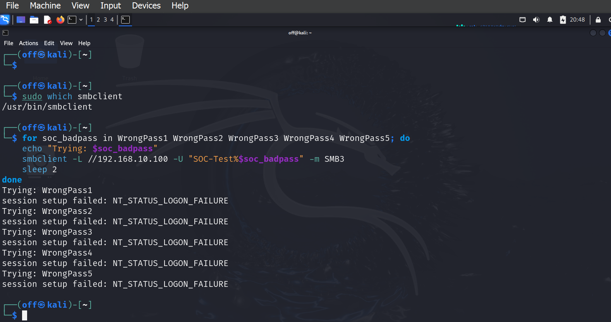

Splunk **Trigger History** records **2026-10-09 17:50:01 UTC**, equivalent to **20:50:01 Asia/Riyadh**. The alert remains enabled with the **Add to Triggered Alerts** action.

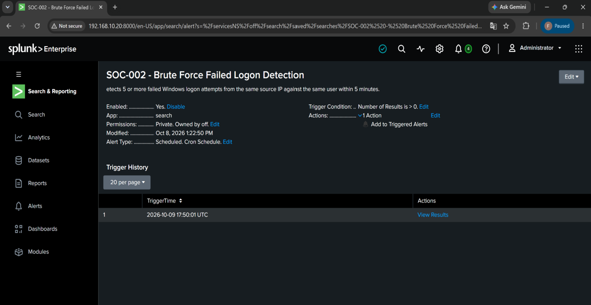

Opening **View Results** shows a scheduler job (`sid=scheduler__...`) rather than a separate manual replay. The completed job displays **5 events** and **Statistics (1)**.

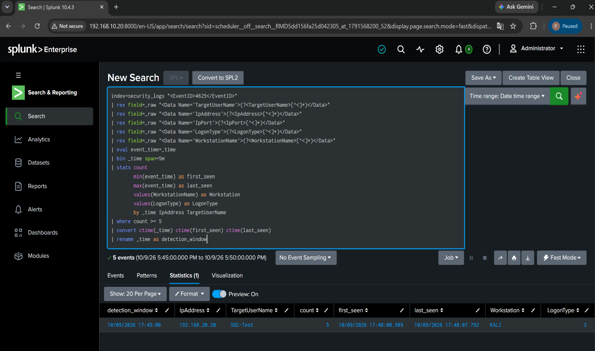

| Field | Scheduled result |
| --- | --- |
| Search window | 2026-10-09 17:45:00–17:50:00, as displayed by Splunk |
| detection_window | 2026-10-09 17:45:00, as displayed by Splunk |
| IpAddress | 192.168.20.20 |
| TargetUserName | SOC-Test |
| count | 5 |
| first_seen | 2026-10-09 17:48:00.989, as displayed by Splunk |
| last_seen | 2026-10-09 17:48:07.792, as displayed by Splunk |
| Workstation | KALI |
| LogonType | 3 — Network |

The scheduled SPL preserves `event_time` before applying five-minute `bin` grouping; this keeps the actual first/last event times in the result. The [repository SPL](../detections/windows-brute-force.spl) now matches the executed query visible in the screenshot.

This retest confirms event generation, Windows Security ingestion, threshold matching, scheduled execution and the recorded alert action. The fresh successful-logon check is attached below. Fresh pfSense correlation has not been captured; the earlier firewall observations belong to the 2026-10-08 exercise.

## Evidence 7 — Successful-logon check for the fresh retest — 2026-10-09

The completed search checks indexed Windows Security Event ID **4624** from source **192.168.20.20**, without restricting the target account. It returns **0 events / Statistics (0)**.

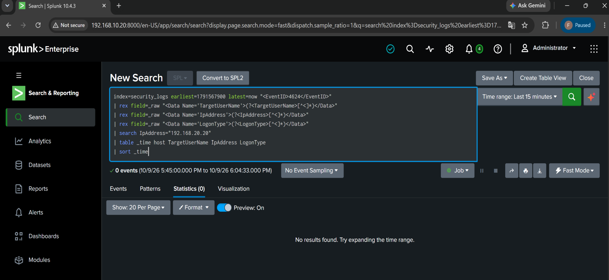

```spl
index=security_logs earliest=1791567900 latest=now "<EventID>4624</EventID>"
| rex field=_raw "<Data Name='TargetUserName'>(?<TargetUserName>[^<]*)</Data>"
| rex field=_raw "<Data Name='IpAddress'>(?<IpAddress>[^<]*)</Data>"
| rex field=_raw "<Data Name='LogonType'>(?<LogonType>[^<]*)</Data>"
| search IpAddress="192.168.20.20"
| table _time host TargetUserName IpAddress LogonType
| sort _time
```

| Field | Captured value |
| --- | --- |
| Index / event | security_logs / 4624 |
| Source filter | IpAddress=192.168.20.20 |
| Start | 2026-10-09 17:45:00, as displayed by Splunk |
| End | 2026-10-09 18:04:33, as displayed by Splunk |
| Matching events / results | 0 / 0 |
| Fresh failed-logon batch | 17:48:00.989–17:48:07.792, inside the checked window |

The screenshot's picker displays **Last 15 minutes**, while the completed job banner shows **17:45:00–18:04:33** for the query's explicit start and `latest=now`. The banner bounds are the recorded evidence window. To repeat that exact interval, replace `latest=now` with `latest=1791569073`.

**Finding:** No matching indexed successful logon from the Kali source was observed in this window. This is scoped to the query, available telemetry and source address; it does not establish absence of activity outside that scope. The original 2026-10-08 full-window successful-logon check remains pending.

## Original screenshot evidence — 2026-10-08

These original PNG captures are attached without changing their pixels. Search results, saved configurations and scheduled triggers are identified separately.

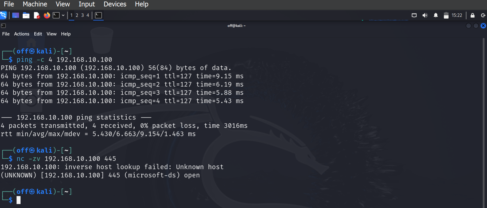

Kali confirms ICMP reachability and TCP 445 open on the Windows lab target.

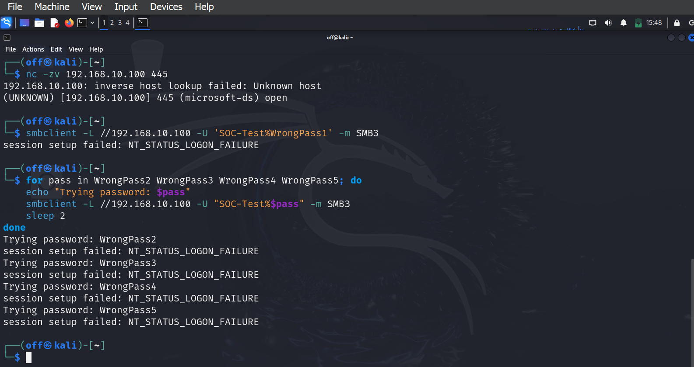

One initial attempt and four subsequent attempts return NT_STATUS_LOGON_FAILURE; displayed passwords are deliberately incorrect test strings.

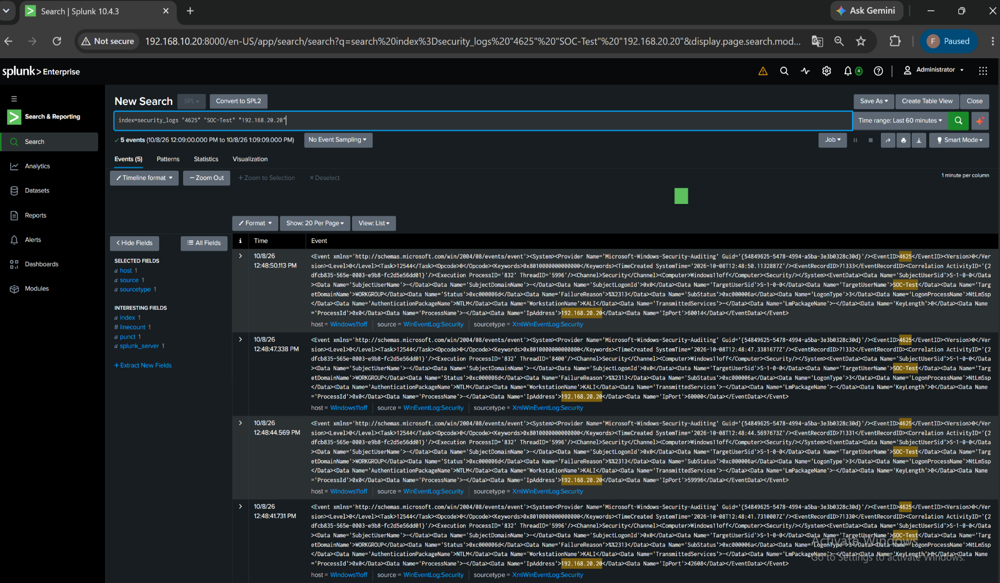

Windows Security 4625 records for SOC-Test and the controlled Kali source are indexed in Splunk.

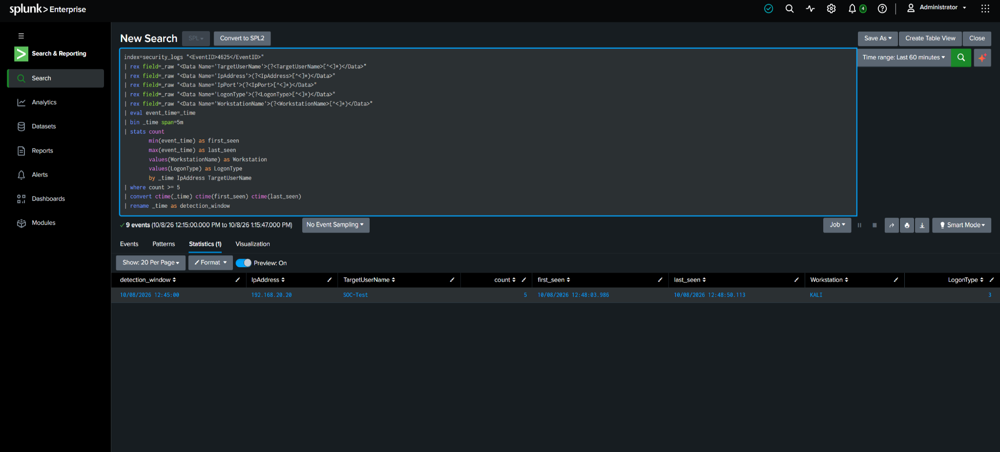

Manual detection returns five failures for 192.168.20.20 / SOC-Test / KALI / LogonType 3, preserving first and last event times.

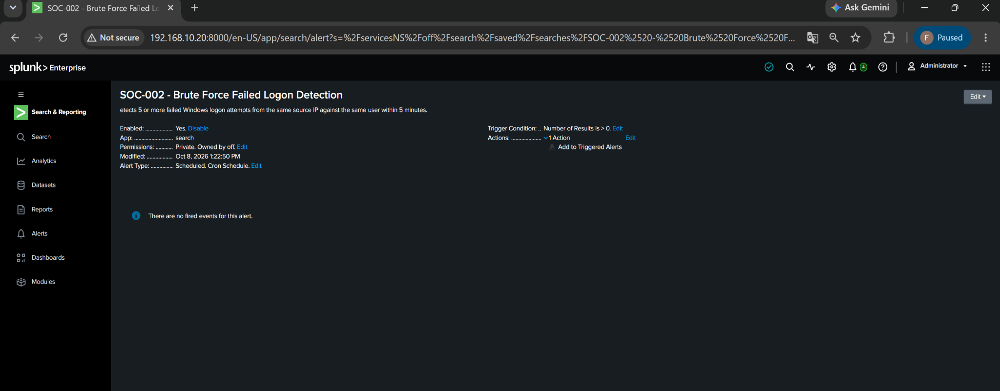

SOC-002 is enabled and scheduled, with Add to Triggered Alerts configured; the capture explicitly shows no fired events.

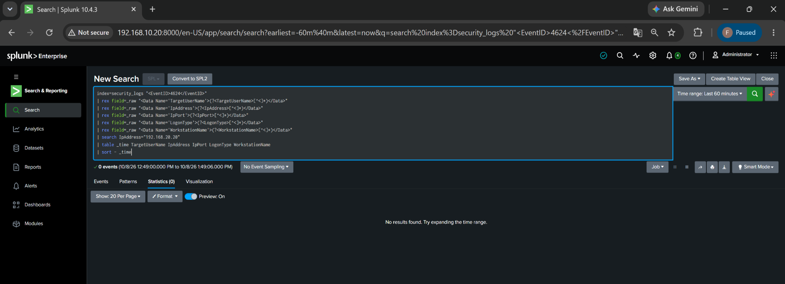

The Event ID 4624 check returns zero events from 192.168.20.20 in the displayed 12:49:00–13:49:06 window; earlier activity is outside this check.

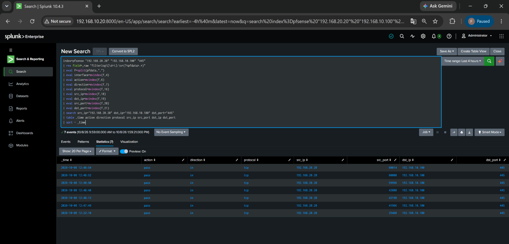

Seven parsed pfSense TCP/445 records show pass/in from Kali to Windows; firewall records and failed-logon counts are distinct.

## Analyst conclusion

The original 2026-10-08 endpoint and firewall evidence agree on source **192.168.20.20**, target **192.168.10.100**, **TCP/445** and the activity period. The 2026-10-09 retest independently confirms five failed network logons for **SOC-Test** and a recorded scheduled alert.

This is a **true positive for brute-force-like failed authentication behavior** in an authorized lab exercise. The fresh 2026-10-09 check shows no matching successful logon from the Kali address across a window that includes the full failed batch. The original 2026-10-08 negative 4624 result covers only its stated follow-up window; complete coverage of that original period remains a follow-up task.

## Response actions for a real SOC

For an equivalent unauthorized event:

1. Validate source ownership and expected administrative activity.
2. Check for subsequent Event ID 4624, privilege changes and suspicious process execution.
3. Review account lockouts, password-reset activity and other targeted accounts.
4. Correlate firewall, VPN, EDR and identity-provider logs.
5. Block or contain the source when appropriate to policy and confidence.
6. Protect/reset the account if compromise is suspected.
7. Escalate severity if successful authentication or post-authentication activity is found.

## Remaining work

- Repeat the 4624 check with a fixed window covering the full original 2026-10-08 failed-logon period, including time before and after the batch.
- Export raw event samples for reproducibility.
- Normalize cross-host timezone handling in a later lab maintenance pass.

[Simulation](../attack-simulations/brute-force.md) · [Detection](../detections/windows-brute-force-detection.md) · [MITRE ATT&CK T1110](https://attack.mitre.org/techniques/T1110/)
