# Case 004 — Suspicious PowerShell encoded execution

**Splunk alert ID:** SOC-003  
**Status:** Controlled execution, initial manual detection, tuning and scheduled alert firing confirmed.

## Executive summary

On 2026-10-09, the Windows 11 lab endpoint executed a deliberately safe PowerShell command using `-NoProfile`, `-WindowStyle Hidden`, and `-EncodedCommand`. Sysmon recorded the process as Event ID **1** and Splunk ingested the event from the Sysmon Operational channel.

The initial broad PowerShell search also returned legitimate PowerShell activity associated with Wazuh. The detection was tuned to require encoded execution together with a hidden window. The tuned query isolated the controlled suspicious event.

A scheduled Splunk alert named **SOC-003 - Suspicious PowerShell Encoded Execution** was then created. A fresh controlled test successfully fired the alert, and **View Results** showed one matching event.

**Verdict:** True positive for the tested suspicious PowerShell behavior.  
**Context:** Authorized lab simulation.  
**Severity:** Medium.  
**Observed impact:** Harmless local file creation only.  
**MITRE ATT&CK:** T1059.001 — PowerShell.

## Visual evidence

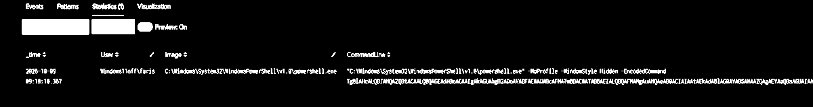

The PNG above is cropped from the captured lab screenshot so the key Splunk result remains readable directly inside the investigation.

## Evidence 1 — Process creation

Sysmon Event ID 1 captured:

| Field | Observed value |
| --- | --- |
| Image | `C:\Windows\System32\WindowsPowerShell\v1.0\powershell.exe` |
| Suspicious flags | `-NoProfile -WindowStyle Hidden -EncodedCommand` |
| User | `Windows11off\faris` |
| Process ID | `9508` in the initial controlled run |
| Process GUID | `{1750da15-a5f0-6ac8-c201-000000003000}` in the initial controlled run |
| Data source | Sysmon Operational / Event ID 1 |

The payload was harmless and wrote a marker string to `%TEMP%\SOC-LAB-PS.txt`.

## Evidence 2 — Detection tuning

A broad search for PowerShell processes returned multiple results. One unrelated event came from PowerShell activity in the Wazuh agent context.

The tuned rule required both encoded execution and a hidden window:

```spl
index=main
sourcetype="XmlWinEventLog:Microsoft-Windows-Sysmon/Operational"
"<EventID>1</EventID>"
("powershell.exe" OR "pwsh.exe")
| rex field=_raw "<Data Name='Image'>(?<Image>[^<]*)</Data>"
| rex field=_raw "<Data Name='CommandLine'>(?<CommandLine>[^<]*)</Data>"
| rex field=_raw "<Data Name='ParentImage'>(?<ParentImage>[^<]*)</Data>"
| rex field=_raw "<Data Name='User'>(?<User>[^<]*)</Data>"
| rex field=_raw "<Data Name='ProcessId'>(?<ProcessId>[^<]*)</Data>"
| rex field=_raw "<Data Name='ProcessGuid'>(?<ProcessGuid>[^<]*)</Data>"
| where match(CommandLine,"(?i)(^|\\s)-(enc|encodedcommand)\\s+")
    AND match(CommandLine,"(?i)-windowstyle\\s+hidden")
| table _time User Image CommandLine ParentImage ProcessId ProcessGuid
| sort - _time
```

The initial manual screenshot uses an OR-based condition and returns one suspicious event. The final rule above requires both conditions; its one-event result is demonstrated by the scheduled **View Results** capture in Evidence 4. These captures show different query versions and should not be treated as the same manual replay.

## Evidence 3 — Related Sysmon events

A review of the initial suspicious process GUID returned two Sysmon events:

- Event ID **1** — the PowerShell process creation.
- Event ID **11** — a PowerShell temporary policy-test script file named similar to `__PSScriptPolicyTest_*.ps1`.

The Event ID 11 record was **not** the `SOC-LAB-PS.txt` payload marker, so it is not treated as evidence of the marker-file creation.

No Sysmon Event ID **3** network-connection event was returned for that same process GUID in the reviewed window. This is documented as **no network connection observed in available Sysmon telemetry for that process**, not as proof that network activity was impossible.

## Evidence 4 — Scheduled alert

The saved alert configuration:

| Setting | Value |
| --- | --- |
| Name | SOC-003 - Suspicious PowerShell Encoded Execution |
| Type | Scheduled |
| Cron | `*/5 * * * *` |
| Time range | Last 5 minutes |
| Trigger | Number of Results > 0 |
| Mode | Once |
| Action | Add to Triggered Alerts |
| Severity | Medium |
| Expiration | 24 hours |

The alert page later displayed a **Trigger History** entry at **2026-10-09 09:20:03 UTC**.

Selecting **View Results** opened the scheduled job and returned **1 event** for the search interval **09:15:00–09:20:00** as shown by Splunk. The matching command line contained the expected PowerShell executable plus `-NoProfile`, `-WindowStyle Hidden` and `-EncodedCommand`.

This confirms:

```text
Safe suspicious PowerShell
          |
          v
Sysmon Event ID 1
          |
          v
Splunk index=main
          |
          v
Tuned detection rule
          |
          v
Scheduled SOC-003 alert
          |
          v
Trigger History / View Results
```

## Original screenshot evidence

These original PNG captures are attached without changing their pixels. Search results, saved configurations and scheduled triggers are identified separately.

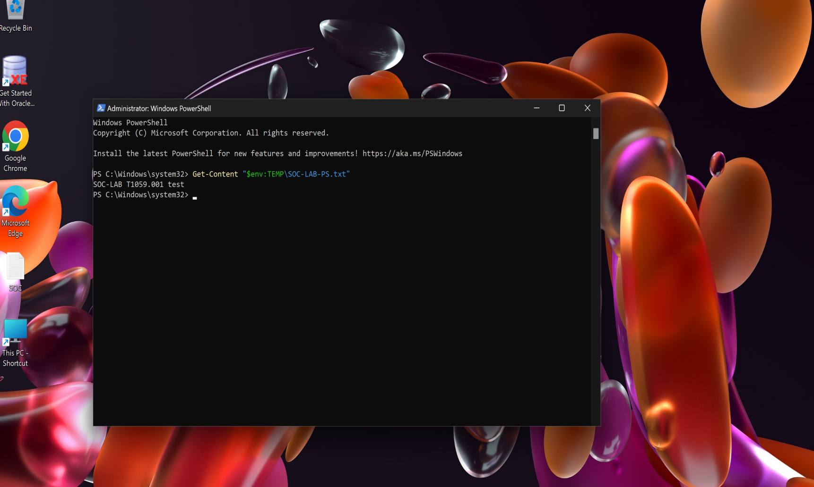

Get-Content confirms the harmless SOC-LAB-PS.txt marker; this alone does not establish which process created it.

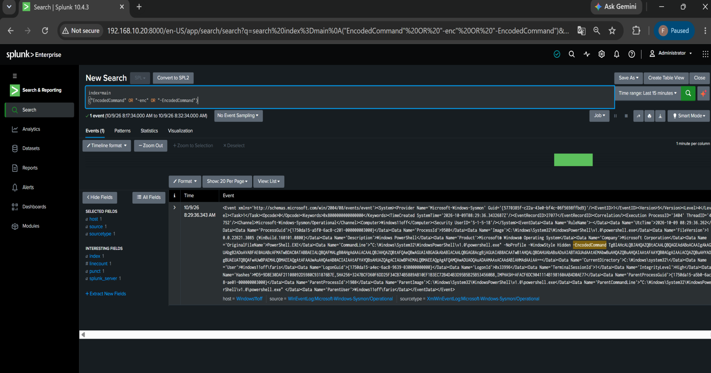

An indexed Sysmon process event contains the controlled encoded PowerShell command.

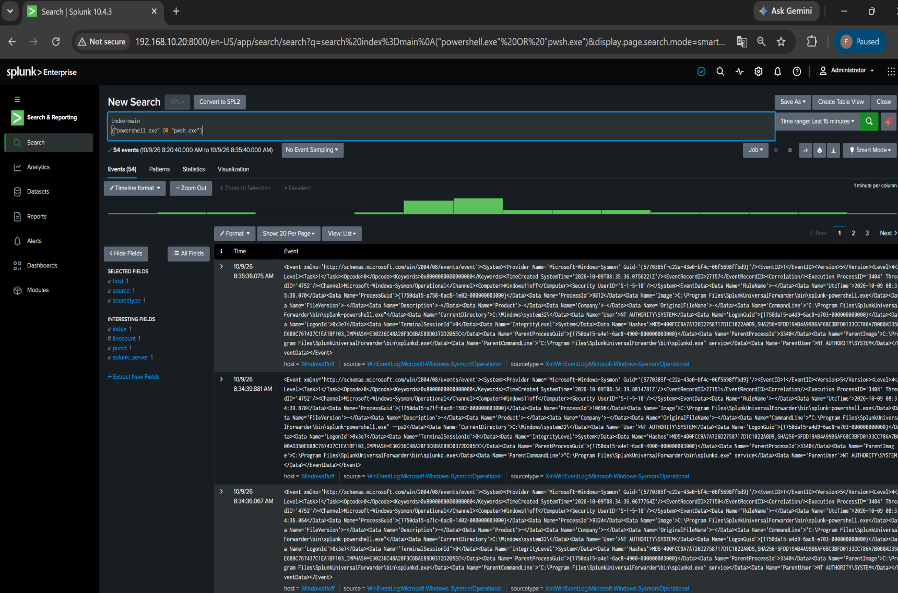

The broad PowerShell search includes unrelated Wazuh agent activity, illustrating the need for tuning.

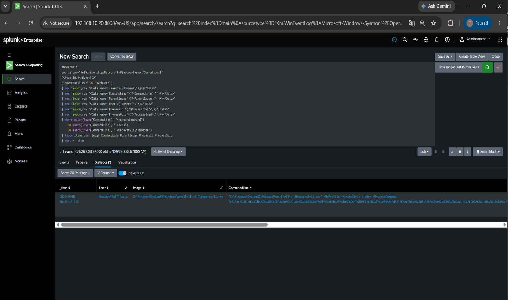

The initial OR-based query returns one PowerShell result with -NoProfile, -WindowStyle Hidden and -EncodedCommand.

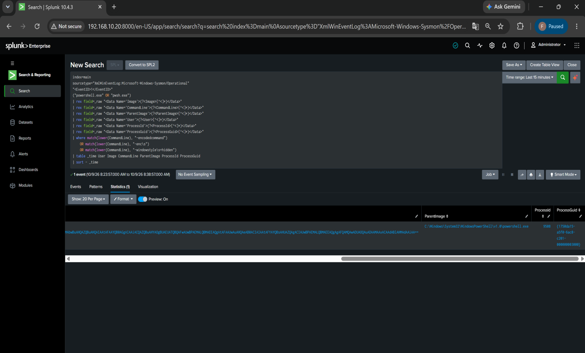

The same initial result exposes ProcessId 9508 and its process GUID; the table is scrolled horizontally.

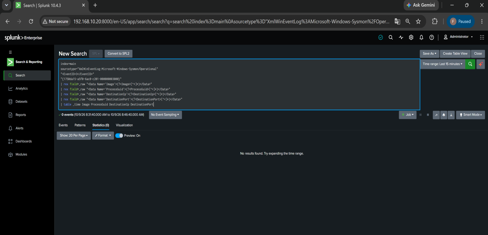

The focused Sysmon Event ID 3 search returns no events for the reviewed process GUID and window.

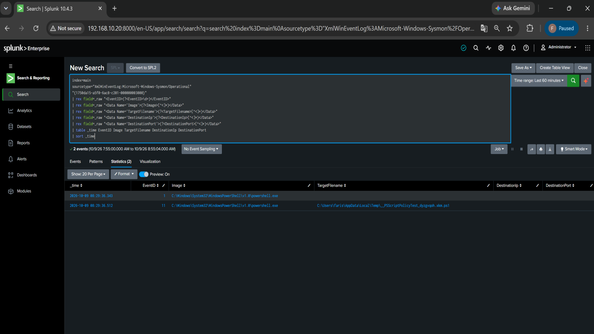

The process-GUID correlation returns Sysmon Event IDs 1 and 11; the file event is a PowerShell policy-test script.

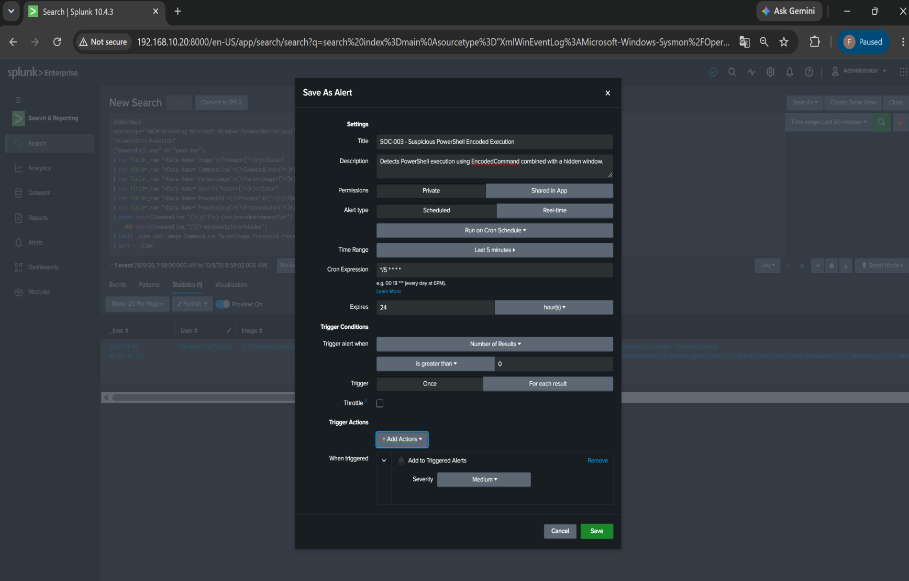

SOC-003 alert form shows the five-minute schedule, result-count trigger and Medium Add to Triggered Alerts action.

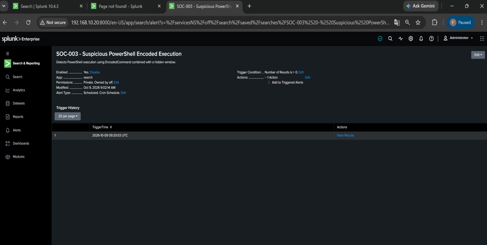

SOC-003 Trigger History records 2026-10-09 09:20:03 UTC.

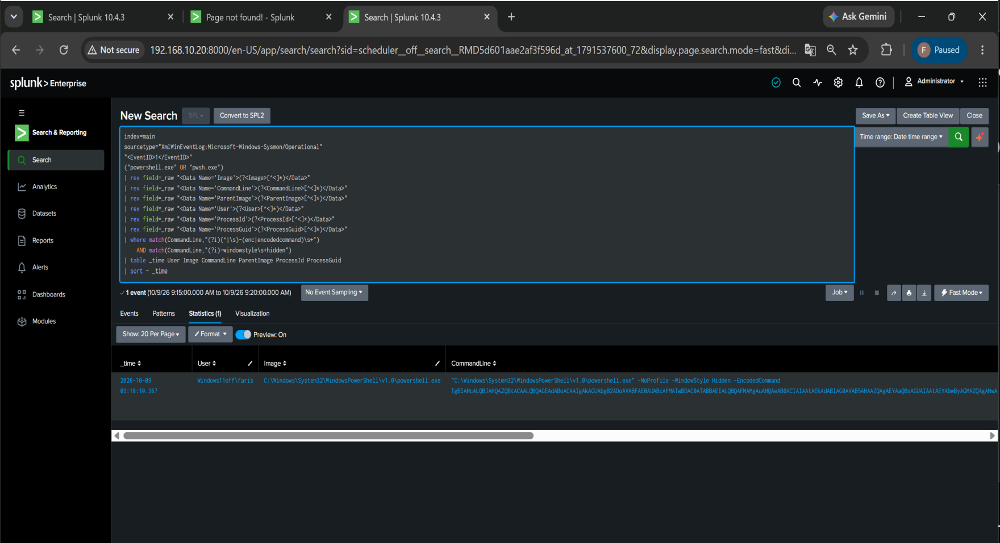

View Results returns one event for 09:15–09:20 using the tuned AND rule requiring encoded execution and a hidden window.

## Analyst conclusion

The alert is a **true positive for the behavior being tested** and an **authorized lab simulation**, not evidence of a real compromise.

The most useful lesson from the exercise is the tuning step: legitimate Wazuh-related PowerShell activity appeared in the broad search, so context and command-line logic were required to reduce noise.

## Real-SOC response considerations

For an equivalent unexpected production event:

1. Review the full decoded command and parent process.
2. Check user, host and privilege context.
3. Correlate process GUID / PID with Sysmon network, file, registry and child-process events.
4. Review PowerShell Script Block Logging if available.
5. Look for downloads, persistence, credential access or lateral movement.
6. Contain the endpoint if malicious intent is supported by evidence.
7. Preserve process, command-line, file and network evidence for escalation.

[Simulation](../attack-simulations/powershell.md) · [Detection](../detections/suspicious-powershell-detection.md) · [MITRE ATT&CK T1059.001](https://attack.mitre.org/techniques/T1059/001/)
