# Case 006 — Ransomware-like mass file activity

**Splunk alert ID:** SOC-005  
**Status:** Simulation, Windows telemetry, manual detection and scheduled alert firing confirmed.

## Executive summary

On 2026-10-09, an authorized ransomware-like simulation was performed against a dedicated lab directory on the Windows 11 endpoint. No real encryption occurred. The exercise created multiple test files with `.encrypted` and `.locked` extensions to reproduce the rapid file-impact pattern a SOC may investigate during ransomware activity.

Sysmon Event ID 11 did not expose the required test-file telemetry under the existing Sysmon configuration. Rather than replacing a working Sysmon configuration, Windows File System auditing was enabled and scoped to the dedicated lab directory. Windows Security Event ID **4663** then provided the necessary telemetry.

Splunk detected **20 distinct files in one minute** during manual validation. A scheduled high-severity alert named **SOC-005 - Possible Ransomware Mass File Activity** was then created. A second batch of 15 files caused the scheduled alert to fire successfully.

**Verdict:** True positive for the simulated mass-file-impact behavior.  
**Context:** Authorized lab simulation; no real data was encrypted.  
**Severity:** High.  
**MITRE ATT&CK:** T1486 — Data Encrypted for Impact.

## Visual evidence


The PNG above is cropped from the captured lab screenshot so the key Splunk result remains readable directly inside the investigation.

## Evidence 1 — Safe simulation

The dedicated directory was:

```text
C:\Users\Public\SOC-RANSOMWARE-LAB
```

The simulation produced test files including:

```text
document_1.txt
document_1.txt.locked
...
README_RECOVER_FILES.txt
```

The original test documents were retained. The `.locked` files contained only a harmless marker string.

## Evidence 2 — Telemetry troubleshooting

An initial Splunk search for Sysmon Event ID 11 returned no matching ransomware-lab file creations.

The active Sysmon service was confirmed:

```text
Service : Sysmon64
State   : Running
Path    : C:\Windows\Sysmon64.exe
```

The current Sysmon configuration was intentionally left unchanged to avoid disrupting previously validated telemetry.

Instead, Windows File System auditing was enabled and a success audit rule was scoped only to the ransomware test directory.

A direct Windows check then confirmed repeated Security Event ID **4663** records for the lab path.

## Evidence 3 — Raw Security telemetry

Splunk returned 20 Event ID 4663 events for the first audited batch.

The structured extraction showed records such as:

```text
User        : faris
ProcessName : C:\Windows\System32\WindowsPowerShell\v1.0\powershell.exe
ObjectName  : C:\Users\Public\SOC-RANSOMWARE-LAB\RUN2_20.encrypted
```

and equivalent records for the remaining test files.

## Evidence 4 — Aggregated detection

The analytic grouped events into a one-minute window and counted distinct object names.

Manual validation returned:

```text
Host         : Windows11off
User         : faris
AccessEvents : 20
UniqueFiles  : 20
ProcessName  : C:\Windows\System32\WindowsPowerShell\v1.0\powershell.exe
```

The threshold was:

```text
UniqueFiles >= 10 per minute
```

## Evidence 5 — Scheduled alert

The Splunk alert was saved as:

```text
SOC-005 - Possible Ransomware Mass File Activity
```

Configuration:

| Setting | Value |
| --- | --- |
| Type | Scheduled |
| Cron | `*/5 * * * *` |
| Search window | Last 5 minutes |
| Trigger | Number of Results > 0 |
| Mode | Once |
| Action | Add to Triggered Alerts |
| Severity | High |
| Expiration | 24 hours |

## Evidence 6 — Alert firing

A new validation batch created 15 files with a `.locked` extension after the alert was enabled.

Trigger History recorded:

```text
2026-10-09 14:20:01 UTC
```

Opening **View Results** returned one aggregated result:

```text
Host         : Windows11off
User         : faris
AccessEvents : 15
UniqueFiles  : 15
ProcessName  : C:\Windows\System32\WindowsPowerShell\v1.0\powershell.exe
```

This validates the complete detection path:

```text
Safe mass file simulation
          |
          v
Windows File System auditing
          |
          v
Security Event ID 4663
          |
          v
Splunk security_logs
          |
          v
UniqueFiles >= 10 / minute
          |
          v
SOC-005 High alert
          |
          v
Trigger History + View Results
```

## Original screenshot evidence

These original PNG captures are attached without changing their pixels. Search results, saved configurations and scheduled triggers are identified separately.

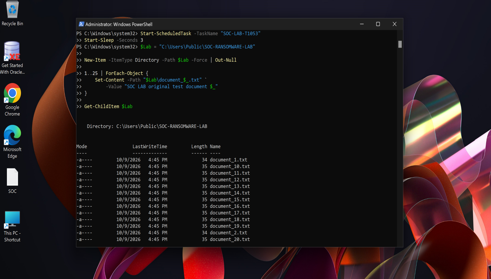

Harmless original documents are created inside C:\Users\Public\SOC-RANSOMWARE-LAB.

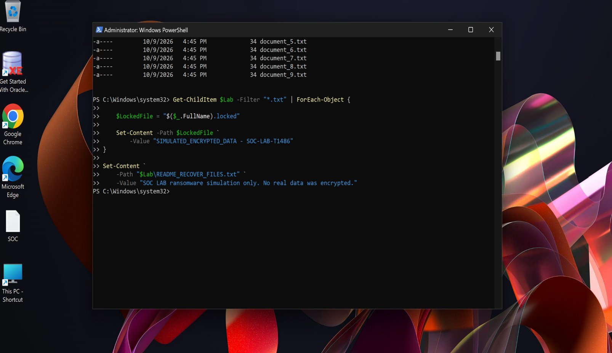

The simulation creates .locked marker files and a lab-only note; no actual encryption command is used.

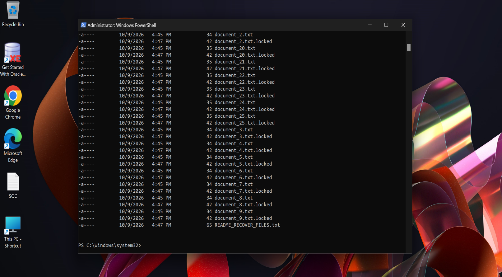

The directory listing contains original .txt documents, matching .locked test files and the lab note.

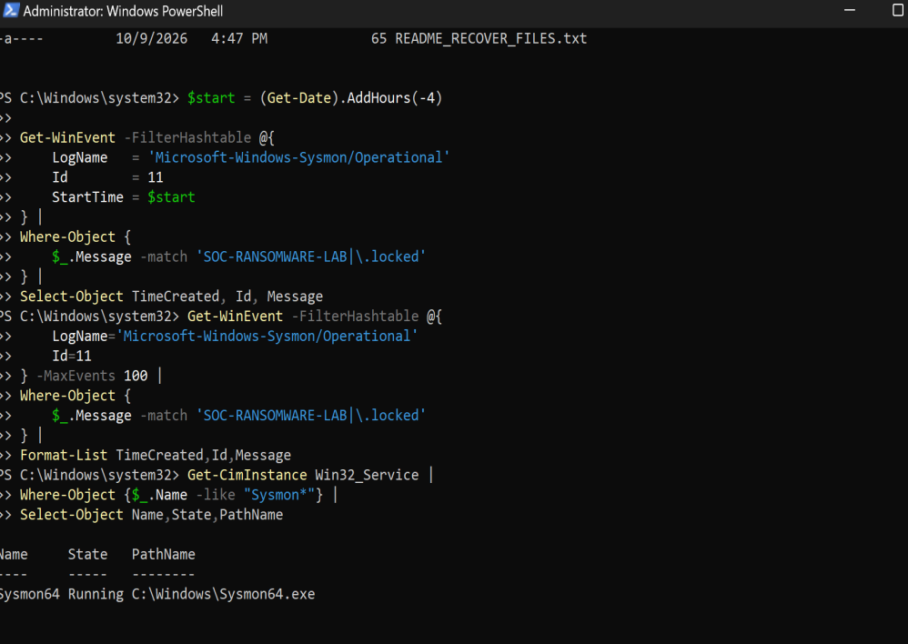

Local Sysmon file-event checks yield no matching output in the reviewed checks, while Sysmon64 is Running.

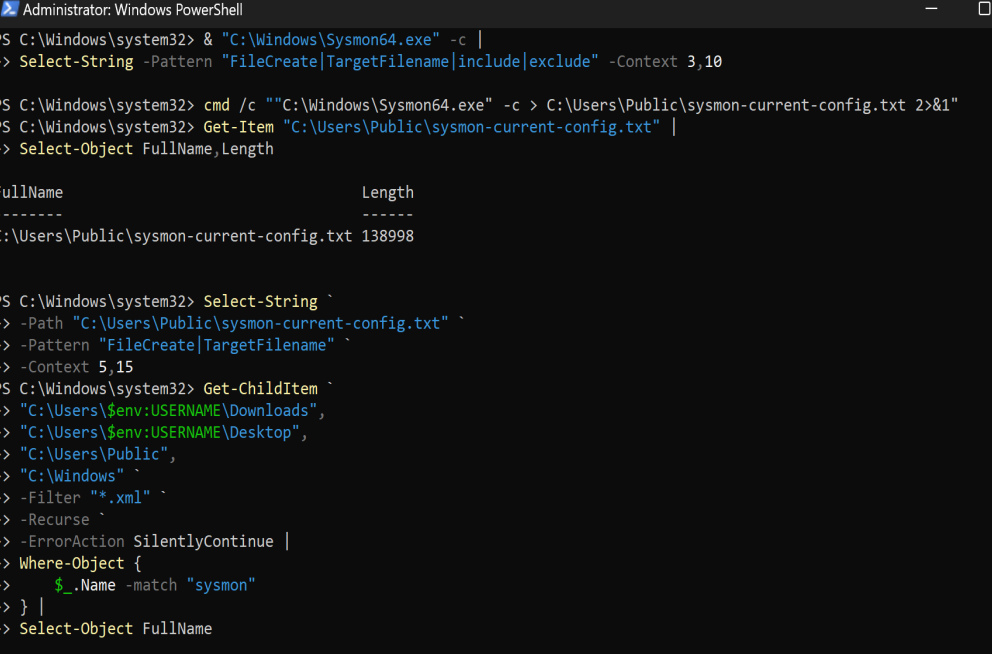

The current Sysmon configuration is exported and searched during telemetry troubleshooting; no replacement is shown.

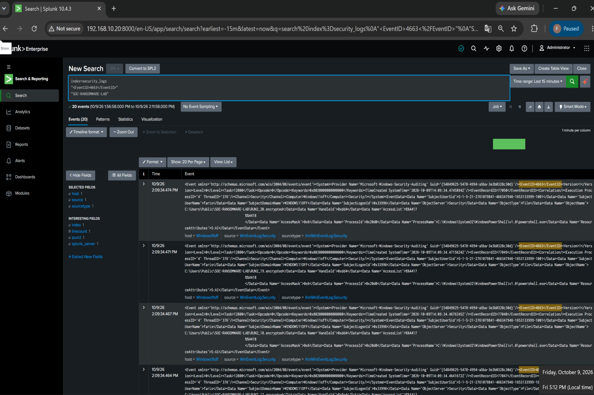

Splunk returns the audited Security Event ID 4663 records for the ransomware lab path.

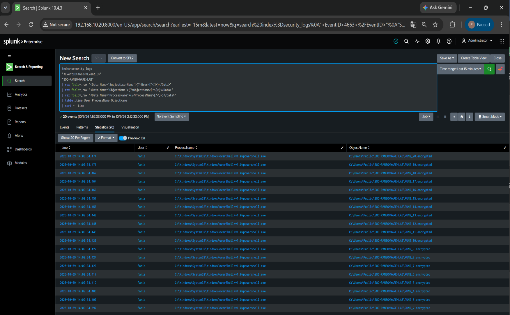

The parsed event table exposes the lab file paths and the PowerShell process.

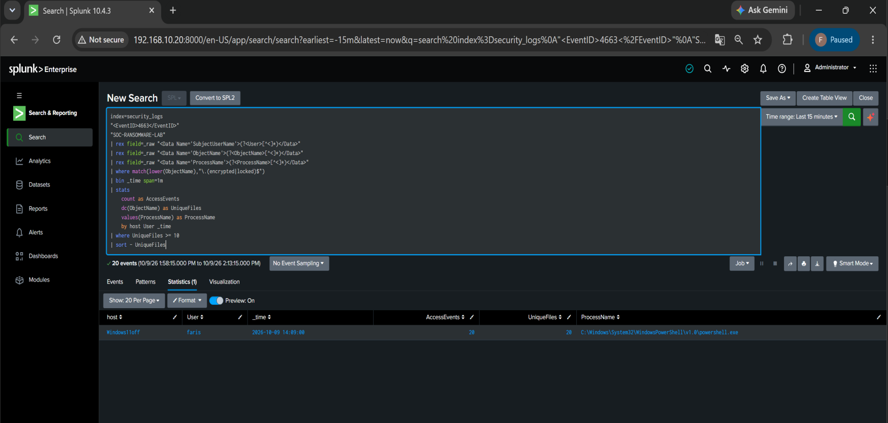

The initial one-minute aggregation returns AccessEvents=20 and UniqueFiles=20.

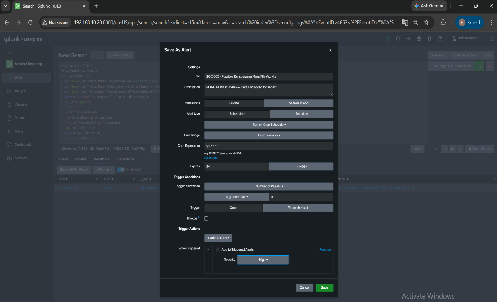

SOC-005 is configured with a five-minute schedule and a High Add to Triggered Alerts action.

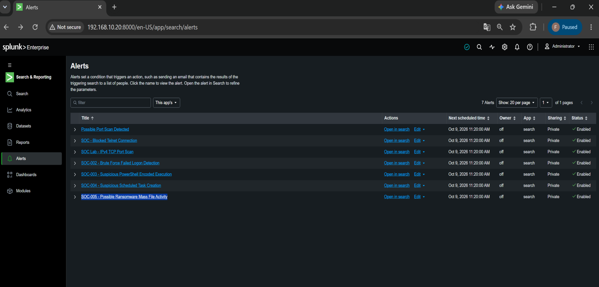

The alert list includes the saved and enabled SOC-005 alert.

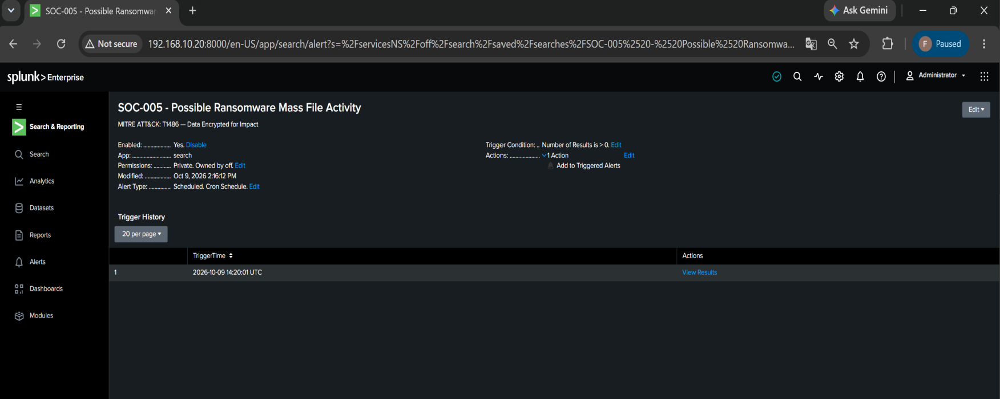

SOC-005 Trigger History records 2026-10-09 14:20:01 UTC.

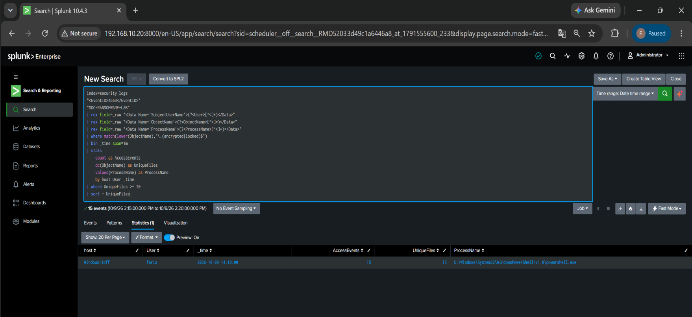

The scheduled View Results returns AccessEvents=15 and UniqueFiles=15 for the fresh validation batch.

## Analyst conclusion

The detection is a **true positive for the simulated file-impact pattern**, but the exercise does not establish real cryptographic encryption or malicious compromise.

The telemetry troubleshooting is an important part of the case: a missing Sysmon event was not incorrectly interpreted as absence of activity. An alternate Windows telemetry source was enabled, validated locally, then confirmed in Splunk.

## Real-SOC response considerations

For comparable unexpected production activity:

1. Identify and isolate the responsible endpoint when malicious impact is suspected.
2. Correlate the process with parent/child process telemetry.
3. Determine the number, location and type of affected files and shares.
4. Look for original-file deletion, rename bursts and ransom-note creation.
5. Check for backup, shadow-copy and recovery-service tampering.
6. Search for credential theft and lateral movement preceding the impact.
7. Preserve relevant process, file and Security/EDR telemetry.
8. Escalate according to incident-response and business-continuity procedures.

[Simulation](../attack-simulations/ransomware-like-file-activity.md) · [Detection](../detections/ransomware-mass-file-activity.md) · [MITRE ATT&CK T1486](https://attack.mitre.org/techniques/T1486/)
