# Lab screenshot evidence

Sixty-five original lab screenshots are included in this gallery and the linked investigations. The original captures were visually inspected and uploaded without changing their pixels. Four additional cropped evidence views are indexed at the end of the gallery. Captions distinguish observed state from work still pending.

## VirtualBox environment baseline — 2026-10-07

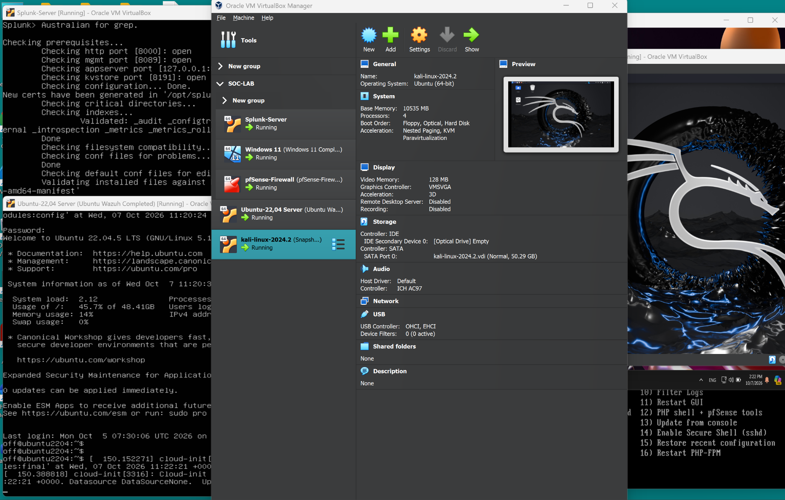

Splunk-Server, Windows 11, pfSense-Firewall, Ubuntu-22,04 Server (Wazuh) and kali-linux-2024.2 are all marked **Running** in VirtualBox. This screenshot proves VM power state at capture time; it does not establish network connectivity, completed Splunk startup, agent collection or clock synchronization. Adapter configuration is still needed to confirm segmentation.

## Windows network and time baseline — 2026-10-07

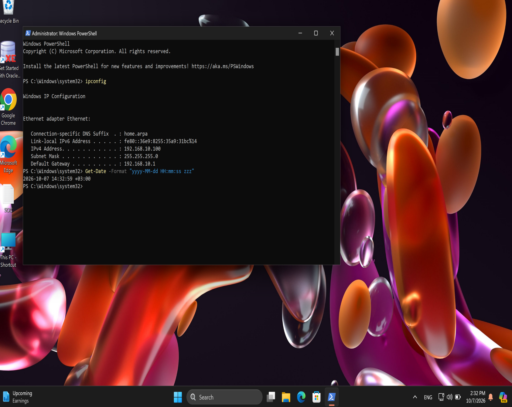

The PowerShell output shows IPv4 **192.168.10.100**, mask **255.255.255.0**, gateway **192.168.10.1**, and displayed time **2026-10-07 14:32:59 +03:00**. These are configuration observations; reachability and cross-host clock synchronization are not demonstrated.

[Baseline details](../architecture/windows-baseline.md)

## Kali route and time baseline — 2026-10-07

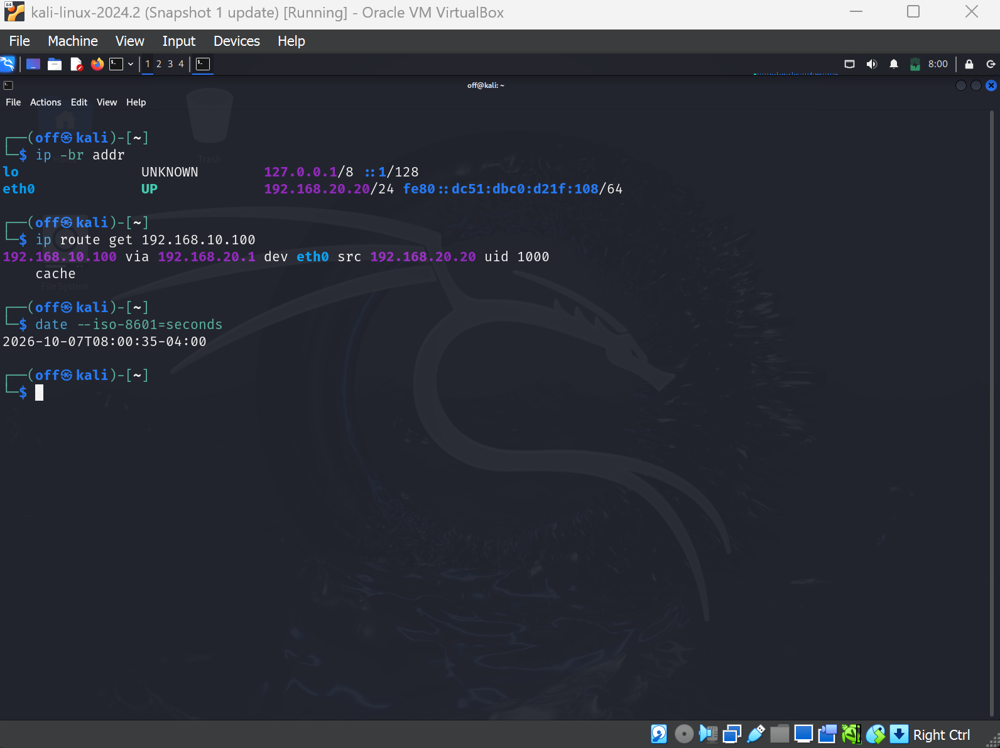

Kali's eth0 is UP at **192.168.20.20/24**. The selected route to **192.168.10.100** uses **192.168.20.1** and source **192.168.20.20**. This shows the routing decision, not a successful connection.

The displayed timestamp **2026-10-07T08:00:35-04:00** represents **15:00:35 at UTC+03:00**. In this initial capture, the timezone differs from Windows; synchronization has not been established.

[Baseline details](../architecture/kali-baseline.md)

## Kali timezone follow-up — 2026-10-07

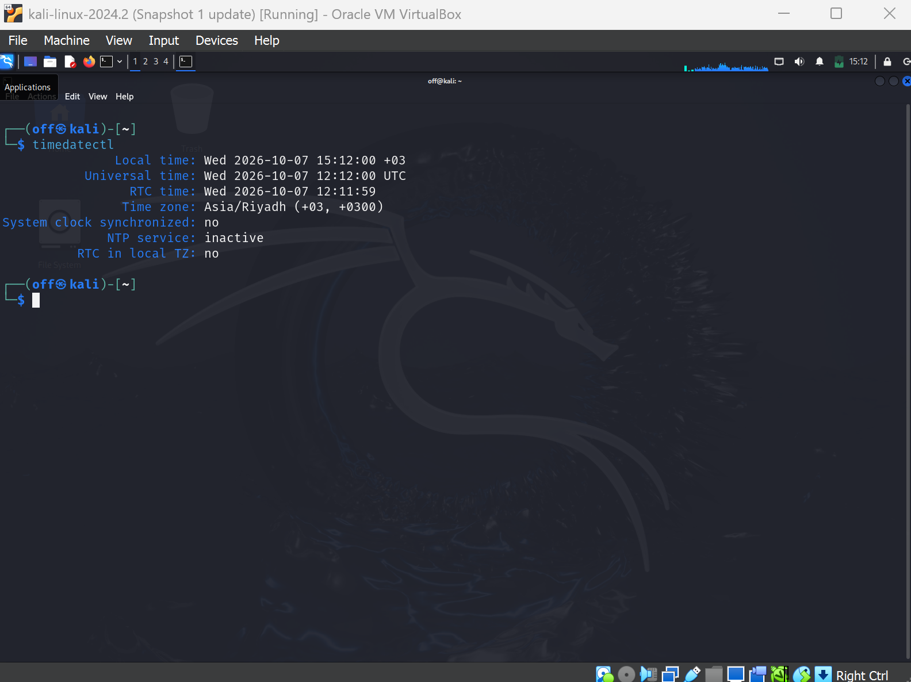

`timedatectl` shows **Asia/Riyadh (+03, +0300)** and local time **2026-10-07 15:12:00 +03**. It also reports **System clock synchronized: no** and **NTP service: inactive**. The timezone change is confirmed; network time synchronization remains pending.

[Baseline details](../architecture/kali-baseline.md)

## Kali gateway reachability — 2026-10-07

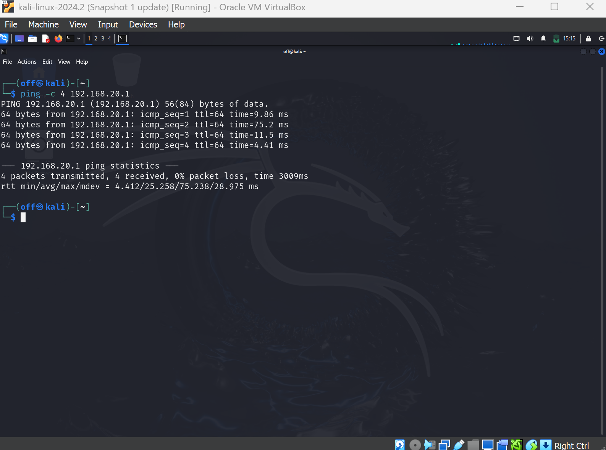

The command `ping -c 4 192.168.20.1` returns **4 transmitted, 4 received, 0% packet loss**, with average RTT **25.258 ms**. This confirms ICMP reachability to the selected next hop. Windows reachability is checked in the following capture; Splunk reachability remains pending.

[Baseline details](../architecture/kali-baseline.md)

## Kali to Windows reachability — 2026-10-07

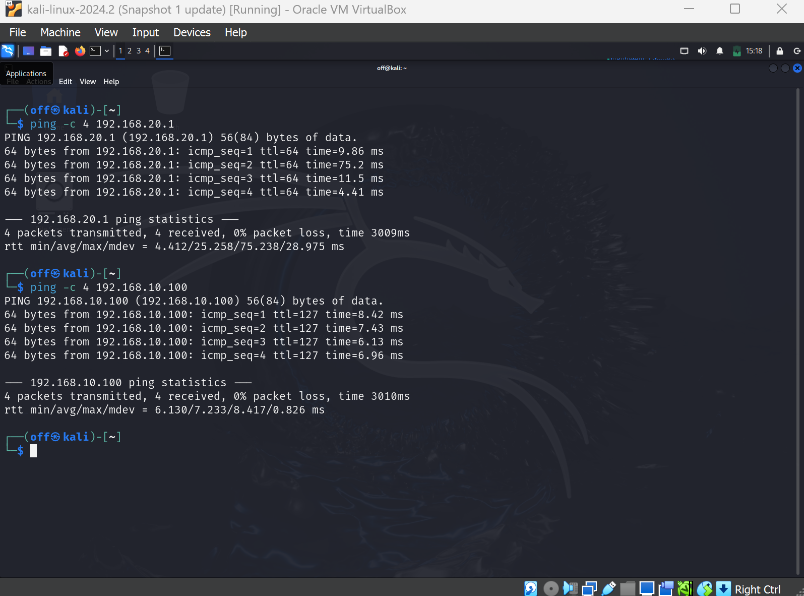

The command `ping -c 4 192.168.10.100` returns **4 transmitted, 4 received, 0% packet loss**, with average RTT **7.233 ms** and reply TTL **127**. This confirms ICMP reachability to the Windows endpoint address. TCP service access and log ingestion require separate validation.

[Baseline details](../architecture/kali-baseline.md)

## Splunk address and startup — 2026-10-07

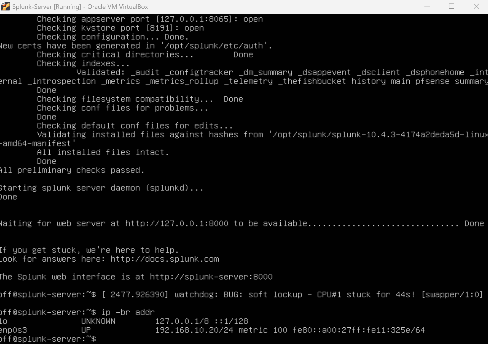

`ip -br addr` shows **enp0s3 UP, 192.168.10.20/24**. Startup output reports `splunkd` started and the local web check on **127.0.0.1:8000** completed. The installation manifest path identifies version **10.4.3**.

A kernel watchdog soft-lockup message for CPU#1 is visible; its cause is not determined. Current receiving sockets and fresh ingestion are not demonstrated.

[Baseline details](../architecture/splunk-baseline.md)

## Splunk web and receiver sockets — 2026-10-07

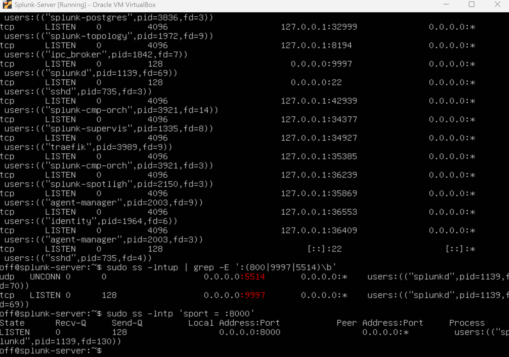

The visible socket output confirms **TCP 8000 LISTEN**, **TCP 9997 LISTEN** and **UDP 5514 UNCONN**, all bound to **0.0.0.0** and owned by **splunkd (PID 1139)**. The first filter checks 800 by mistake; the subsequent command correctly checks 8000. These are local socket observations, not proof of remote access or fresh ingestion.

[Baseline details](../architecture/splunk-baseline.md)

## pfSense search validation — 2026-10-07

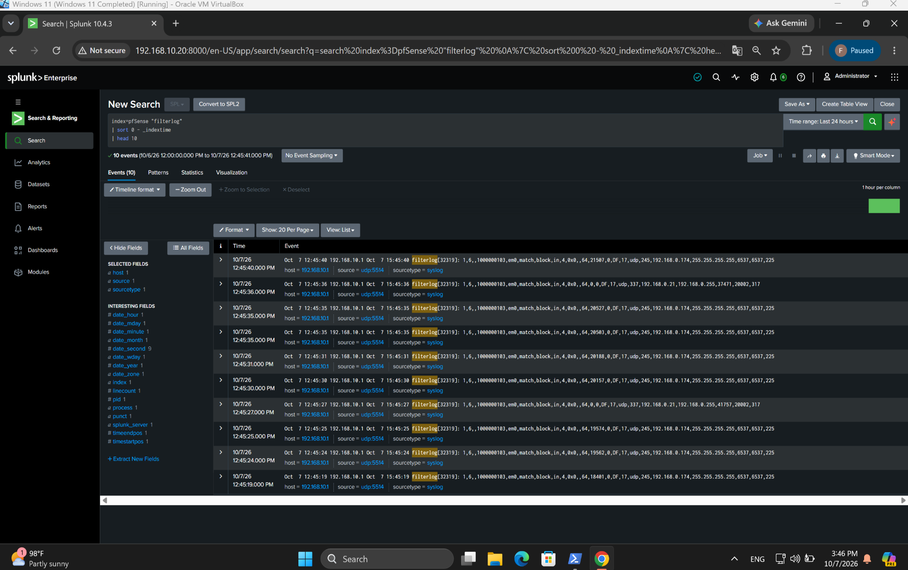

Splunk Web at **192.168.10.20:8000** is open in the Windows VM. The search in **Last 24 hours** returns 10 events after `head 10`, with host **192.168.10.1**, source **udp:5514**, and sourcetype **syslog**. The visible events are background UDP broadcasts blocked inbound on em0, not a Kali TCP scan.

The displayed event time and raw prefixes show a three-hour difference whose cause is unverified.

[Search and timestamp details](../splunk/pfsense-ingestion-check.md)

## Controlled Kali TCP scan — 2026-10-07

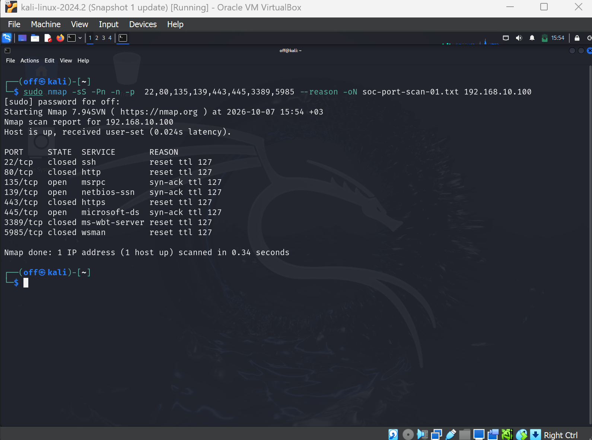

Nmap **7.94SVN** starts at **15:54 +03**, targets **192.168.10.100**, and completes in **0.34 seconds**. The command scans eight ports: **135, 139 and 445 are reported open**, while **22, 80, 443, 3389 and 5985 are closed**. Reasons are SYN-ACK for open ports and reset for closed ports.

This is scan execution evidence. Matching firewall records and the grouped analytic are attached below. Later 2026-10-09 screenshots record Trigger History and matching scheduled results that replay this scan's fixed historical time window. Fresh relative-window validation is captured in the 2026-10-10 sections below.

[Case 002](../investigations/incident-002-controlled-port-scan.md)

## Case 002 firewall correlation — 2026-10-07

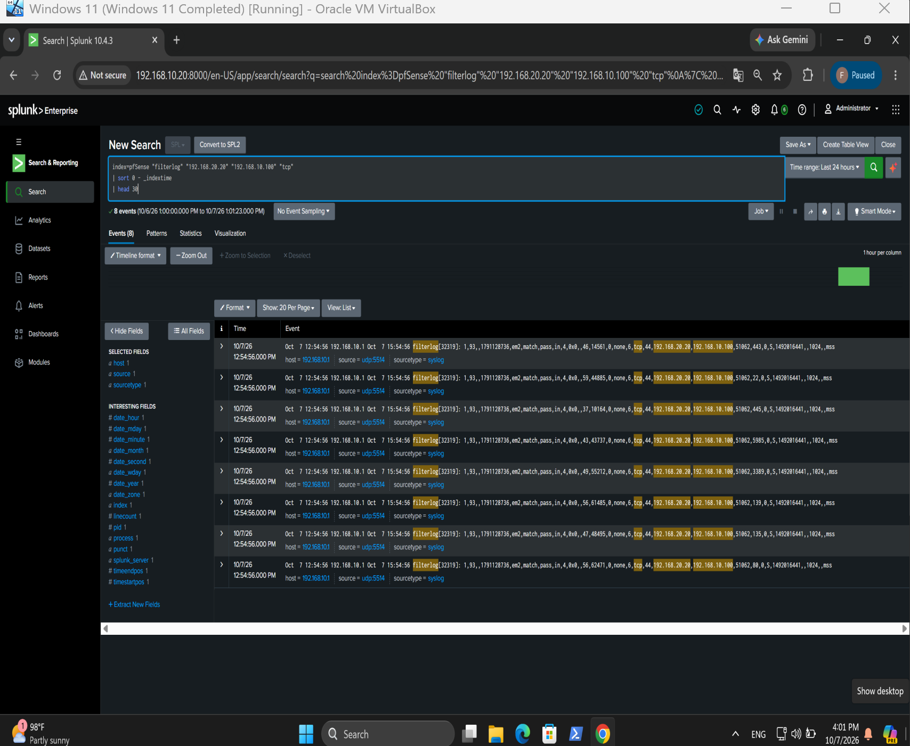

The captured **Last 24 hours** search returns **8 events** from **192.168.20.20** to **192.168.10.100**, covering exactly the eight scanned TCP ports. All visible rows show **pass / in** on **em2**, source port **51062** and SYN flag **S**. Metadata identifies host **192.168.10.1**, source **udp:5514** and sourcetype **syslog**.

The displayed event time is **12:54:56 PM**; raw prefixes contain **12:54:56** and **15:54:56**. Numeric event/index times and configured timezone are not shown. Matching addresses, port set and the embedded 15:54 minute support correlation with the Nmap run. Firewall permission does not mean every port was open.

This proves indexed matching records. The grouped detection result is attached below. The separate 2026-10-09 Trigger History and View Results captures establish scheduled replay of this scan's fixed historical window; a completed fresh scan and its relative-window scheduled result are captured below.

[Case 002 and replay query](../investigations/incident-002-controlled-port-scan.md)

## Case 002 grouped detection result — 2026-10-07

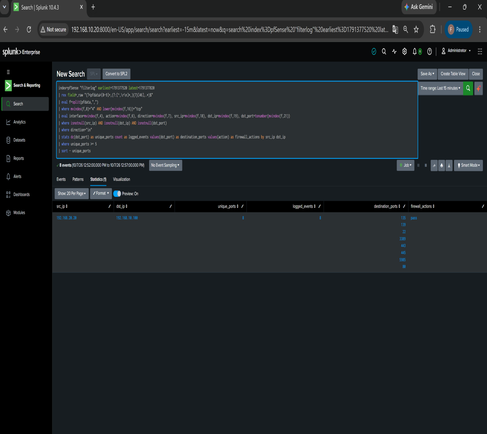

The completed search shows **8 events** and **Statistics (1)**. Its one row reports source **192.168.20.20**, destination **192.168.10.100**, **unique_ports=8**, **logged_events=8**, the exact eight scanned destination ports and **firewall_actions=pass**.

The query uses an IPv4 TCP filter, inbound direction, grouping by source/destination and a threshold of at least five distinct ports, without a hard-coded attacker IP. The explicit epoch bounds select a five-minute interval; the job banner shows **12:52:00–12:57:00 PM on 2026-10-07**, despite the picker showing Last 15 minutes.

This validates the manual detection replay for the authorized scan. It does not show scheduled alert firing. Optional first_seen/last_seen columns from the generic SPL are absent from the executed variant.

[Case 002](../investigations/incident-002-controlled-port-scan.md) · [Executed replay SPL](../investigations/incident-002-replay.spl)

## Firewall events collected in Splunk

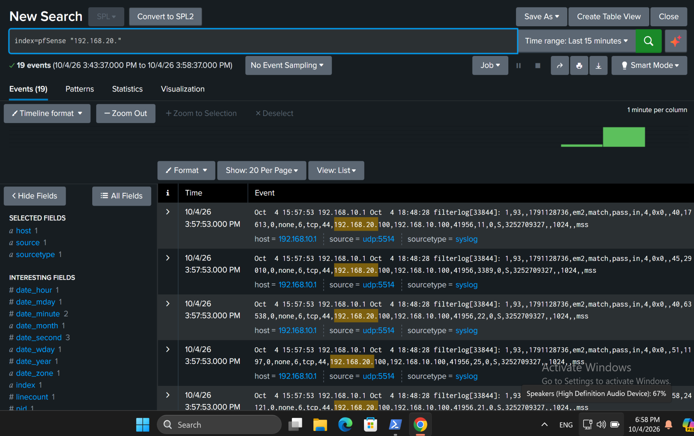

The screenshot shows 19 results in its selected 15-minute window, filterlog CSV events, source `192.168.20.100`, destination `192.168.10.100`, and receiver metadata `udp:5514`. See the [case analysis](../investigations/incident-001-port-scan.md) for timestamp limitations.

## Parsed firewall events

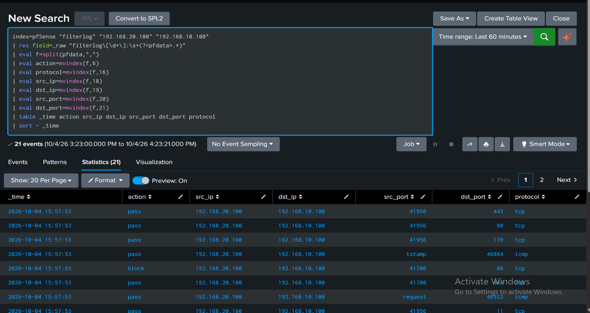

An actual search displays 21 results over a different 60-minute window. TCP fields and pass/block actions are visible. The historical query also parses ICMP rows as though they had TCP ports; the revised query excludes them. This image does not show the revised grouped analytic.

## Saved scheduled alert

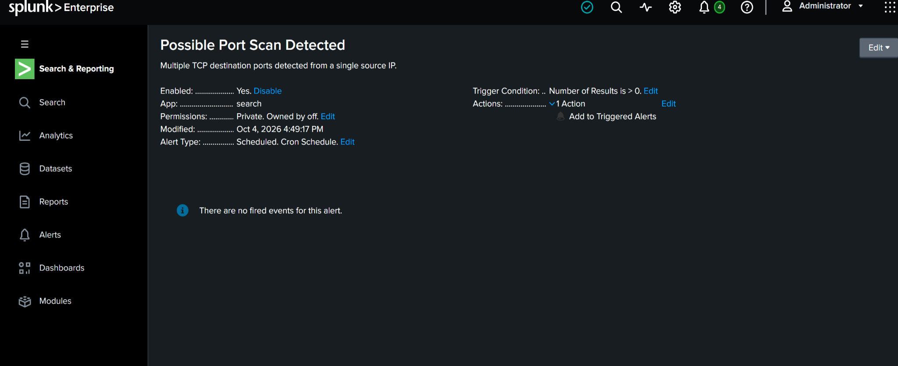

The alert is enabled and scheduled. The page explicitly shows **no fired events** at the captured time. The exact cron expression and a successful scheduled run are not visible.

## Port-scan scheduled Trigger History — 2026-10-09

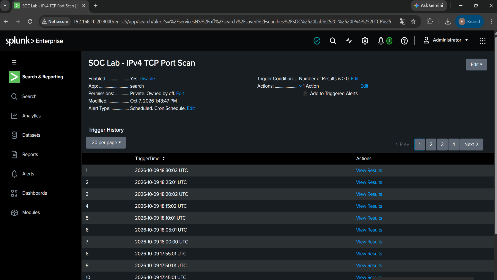

The actual saved alert is named **SOC Lab - IPv4 TCP Port Scan**. It is **enabled**, its type is **Scheduled / Cron Schedule**, its condition is **Number of Results > 0**, and its action is **Add to Triggered Alerts**. The newest visible trigger is **2026-10-09 18:30:02 UTC (21:30:02 Asia/Riyadh)**. Multiple preceding rows recur at approximately five-minute intervals.

This original screenshot proves scheduled alert firing. It does not itself show the saved SPL, exact cron expression, earliest/latest bounds or result rows. The following View Results capture ties the inspected firing to the fixed 2026-10-07 scan window and explains the repeated historical-result alerts.

[Case 002](../investigations/incident-002-controlled-port-scan.md) · [Observed alert state and schedule proposal](../splunk/alerts.md)

## Port-scan scheduled historical replay — 2026-10-09

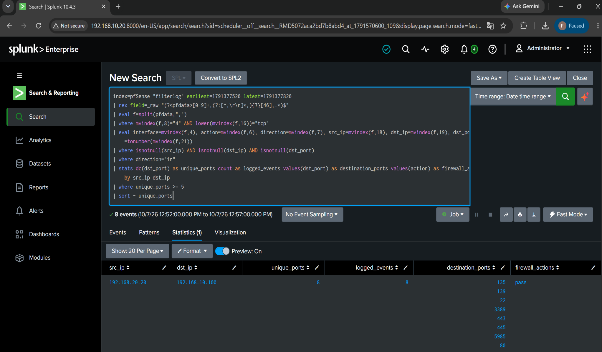

The URL contains a **scheduler** job identifier with `at_1791570600`, corresponding to **2026-10-09 18:30:00 UTC** and the preceding **18:30:02 UTC** Trigger History row. The search still contains `earliest=1791377520 latest=1791377820`. Its completed-job banner shows **8 events** over **2026-10-07 12:52–12:57**, and **Statistics (1)** contains **192.168.20.20 → 192.168.10.100**, **8 distinct ports**, **8 logged events** and **pass**.

The destination ports match the recorded scan: **22, 80, 135, 139, 443, 445, 3389, 5985**. This is scheduled replay of historical test data. Fixed bounds make unchanged old events eligible on each run; this historical scheduler job does not demonstrate relative-window operation. A fresh completed scan and its corrected relative-window scheduled result are captured below.

[Case 002 diagnosis and correction](../investigations/incident-002-controlled-port-scan.md) · [Alert correction](../splunk/alerts.md)

## Fresh Kali eight-port scan — 2026-10-10

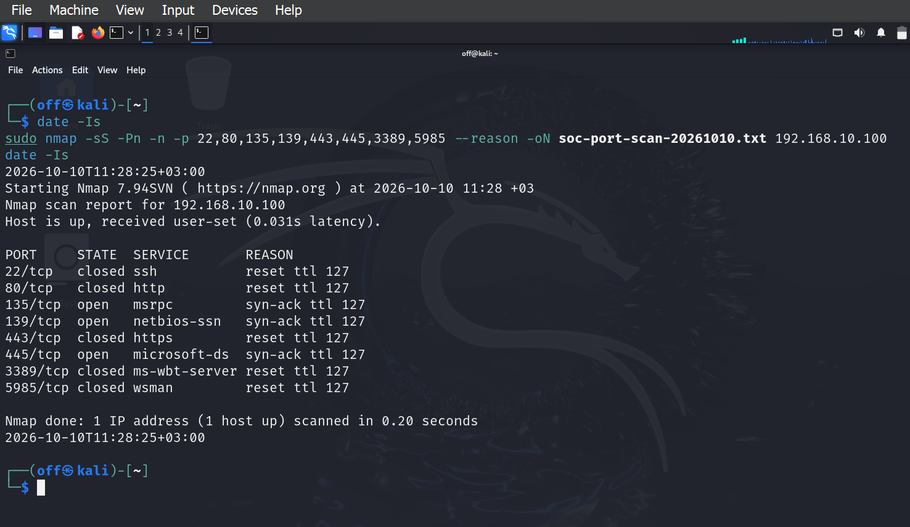

The timestamps before and after the command both show **2026-10-10T11:28:25+03:00 (08:28:25 UTC)**. Nmap **7.94SVN** completes an eight-port SYN scan of **192.168.10.100**, reporting **1 IP address / 1 host up**, **0.20 seconds** elapsed and **0.031 seconds** latency. Ports **135, 139 and 445** are **open** with SYN-ACK responses; **22, 80, 443, 3389 and 5985** are **closed** with reset responses. All displayed response TTLs are **127**.

This proves fresh scan execution and visible target responses after the earlier failed route setup. The screenshot does not expose Kali's current source address, selected gateway or the configuration change that enabled the run. The later scheduled result below confirms the indexed source/destination pair, port set and executed relative bounds; individual raw event review and the exact cron expression remain pending. The native `soc-port-scan-20261010.txt` file has not yet been uploaded.

[Case 002 fresh execution evidence](../investigations/incident-002-controlled-port-scan.md) · [Simulation](../attack-simulations/port-scan.md)

## Fresh port-scan Trigger History — 2026-10-10

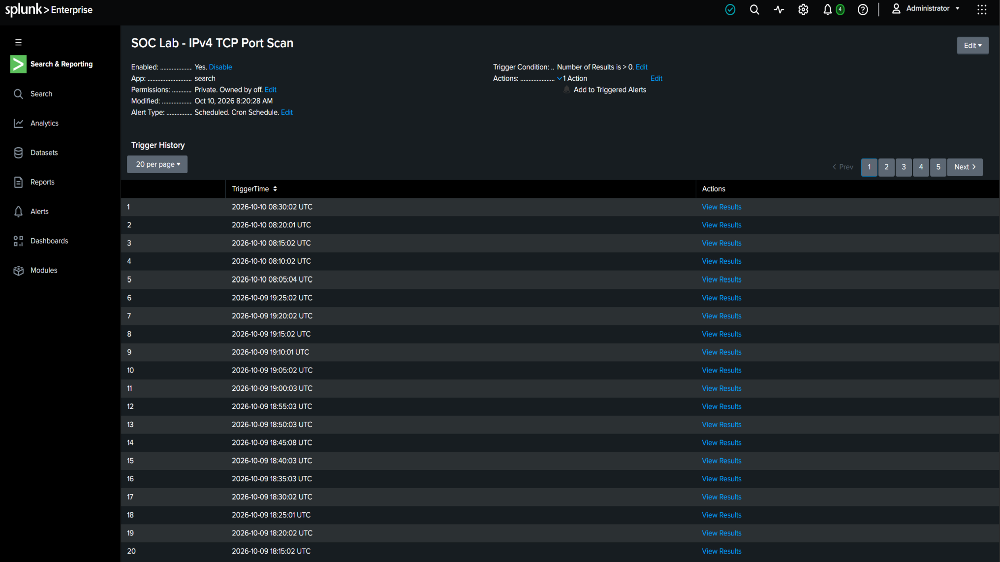

**SOC Lab - IPv4 TCP Port Scan** is enabled, **Scheduled / Cron Schedule**, and configured for **Number of Results > 0** with **Add to Triggered Alerts**. Trigger History records **2026-10-10 08:30:02 UTC (11:30:02 Asia/Riyadh)**. The modified field displays **Oct 10, 2026 8:20:28 AM** without an explicit offset. Older history rows are preserved; only the fresh firing's scheduler result is correlated below.

## Fresh port-scan scheduled results — 2026-10-10

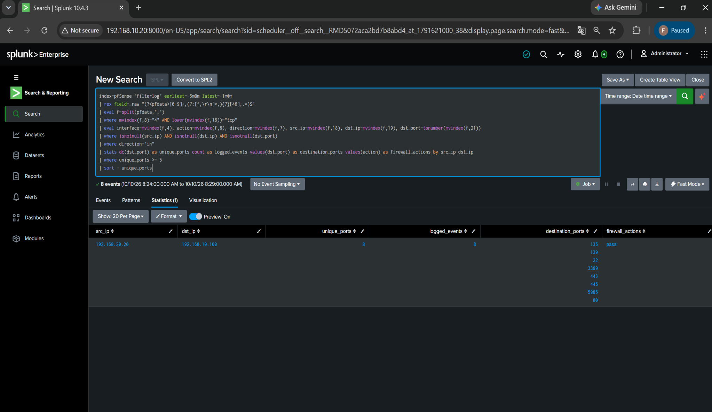

The scheduler identifier contains `at_1791621000`, corresponding to **2026-10-10 08:30:00 UTC**. The executed first line uses **earliest=-6m@m / latest=-1m@m**, and the completed-job banner shows **08:24–08:29 on 2026-10-10**, with **8 events / Statistics (1)**.

The grouped row reports **192.168.20.20 → 192.168.10.100**, **unique_ports=8**, **logged_events=8**, destination ports **22, 80, 135, 139, 443, 445, 3389, 5985**, and **firewall_actions=pass**. The selected window contains the fresh scan's displayed **08:28:25 UTC** time and the port set matches its command. This validates the corrected relative-window scheduled detection for this controlled test; native/raw exports and exact cron configuration remain pending.

[Case 002 complete evidence](../investigations/incident-002-controlled-port-scan.md) · [Executed scheduled SPL](../detections/pfsense-ipv4-port-scan-scheduled.spl)

## pfSense OPT1 rule in progress

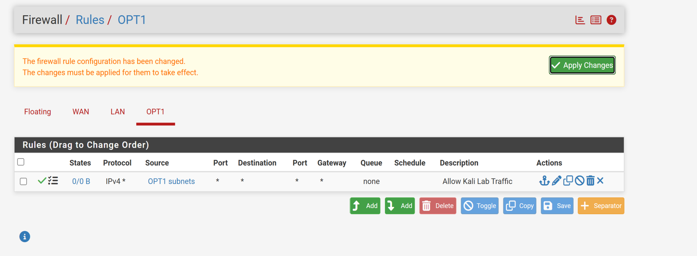

The exercise rule is present, but the **Apply Changes** banner is still visible. This documents setup in progress rather than proof that the pictured rule was active.

## Wazuh connected endpoint

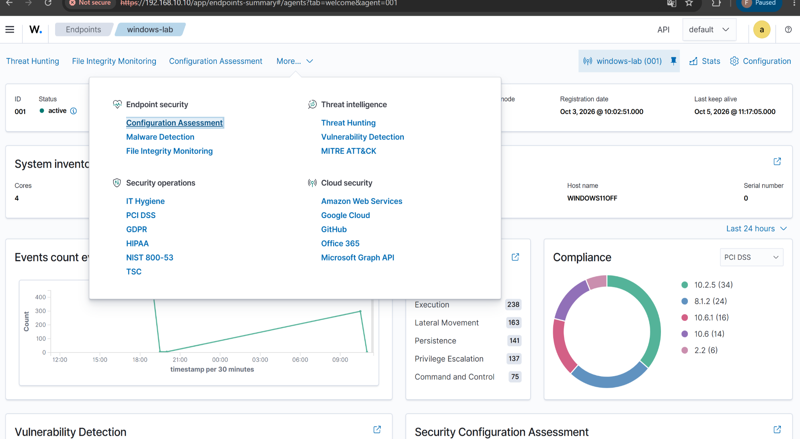

The Wazuh endpoint page shows **windows-lab**, ID **001**, status **active**, host **WINDOWS11OFF**, and last keep alive **Oct 5, 2026 @ 11:17:05.000**. The dashboard URL is `192.168.10.10`.

Summary charts are visible, but individual event details are not. Technique/compliance summaries do not independently prove those behaviors occurred or compliance was achieved.

## Evidence for the four subsequent attack investigations — 2026-10-08–09

The following **43 original PNGs** complete the uploaded screenshot evidence for these four cases. Alongside the existing controlled port-scan images, the repository now contains screenshot evidence for all **five distinct attack scenarios**. Each investigation embeds its own captures with captions. Brute-force scheduled firing is confirmed by the 2026-10-09 retest below. Port-scan relative-window correction, fresh Trigger History and matching scheduled results are captured above. Scheduled firing and matching results are now evidenced for all five scenarios.

### Case 3 — Controlled SMB failed logons

[Open the investigation](../investigations/incident-003-brute-force.md)

| PNG capture | Observed evidence |
| --- | --- |
| [kali-smb-reachability-case003.png](kali-smb-reachability-case003.png) | Kali confirms ICMP reachability and TCP 445 open on the Windows lab target. |
| [kali-smb-failed-logons-case003.png](kali-smb-failed-logons-case003.png) | One initial attempt and four subsequent attempts return NT_STATUS_LOGON_FAILURE; displayed passwords are deliberately incorrect test strings. |
| [splunk-security-4625-raw-case003.png](splunk-security-4625-raw-case003.png) | Windows Security 4625 records for SOC-Test and the controlled Kali source are indexed in Splunk. |
| [splunk-brute-force-result-case003.png](splunk-brute-force-result-case003.png) | Manual detection returns five failures for 192.168.20.20 / SOC-Test / KALI / LogonType 3, preserving first and last event times. |
| [splunk-brute-force-alert-enabled-case003.png](splunk-brute-force-alert-enabled-case003.png) | SOC-002 is enabled and scheduled, with Add to Triggered Alerts configured; the capture explicitly shows no fired events. |
| [splunk-successful-logon-check-case003.png](splunk-successful-logon-check-case003.png) | The Event ID 4624 check returns zero events from 192.168.20.20 in the displayed 12:49:00–13:49:06 window; earlier activity is outside this check. |
| [splunk-smb-firewall-correlation-case003.png](splunk-smb-firewall-correlation-case003.png) | Seven parsed pfSense TCP/445 records show pass/in from Kali to Windows; firewall records and failed-logon counts are distinct. |
| [kali-smb-failed-logons-retest-20261009-case003.png](kali-smb-failed-logons-retest-20261009-case003.png) | A fresh five-attempt SMB test returns NT_STATUS_LOGON_FAILURE for each deliberately incorrect password. |
| [splunk-brute-force-alert-triggered-20261009-case003.png](splunk-brute-force-alert-triggered-20261009-case003.png) | SOC-002 Trigger History records a scheduled firing at 2026-10-09 17:50:01 UTC. |
| [splunk-brute-force-scheduled-results-20261009-case003.png](splunk-brute-force-scheduled-results-20261009-case003.png) | The scheduled View Results job returns 5 events and one grouped result for 192.168.20.20 / SOC-Test / KALI / LogonType 3. |
| [splunk-successful-logon-check-retest-20261009-case003.png](splunk-successful-logon-check-retest-20261009-case003.png) | The fresh-test successful-logon search returns 0 matching Security 4624 events from 192.168.20.20 over 17:45:00–18:04:33 on 2026-10-09, as displayed by Splunk. |

### Case 4 — Suspicious PowerShell encoded execution

[Open the investigation](../investigations/incident-004-suspicious-powershell.md)

| PNG capture | Observed evidence |
| --- | --- |
| [windows-powershell-marker-case004.png](windows-powershell-marker-case004.png) | Get-Content confirms the harmless SOC-LAB-PS.txt marker; this alone does not establish which process created it. |
| [splunk-powershell-encoded-raw-case004.png](splunk-powershell-encoded-raw-case004.png) | An indexed Sysmon process event contains the controlled encoded PowerShell command. |
| [splunk-powershell-broad-search-case004.png](splunk-powershell-broad-search-case004.png) | The broad PowerShell search includes unrelated Wazuh agent activity, illustrating the need for tuning. |
| [splunk-powershell-initial-result-case004.png](splunk-powershell-initial-result-case004.png) | The initial OR-based query returns one PowerShell result with -NoProfile, -WindowStyle Hidden and -EncodedCommand. |
| [splunk-powershell-process-guid-case004.png](splunk-powershell-process-guid-case004.png) | The same initial result exposes ProcessId 9508 and its process GUID; the table is scrolled horizontally. |
| [splunk-powershell-network-check-case004.png](splunk-powershell-network-check-case004.png) | The focused Sysmon Event ID 3 search returns no events for the reviewed process GUID and window. |
| [splunk-powershell-related-events-case004.png](splunk-powershell-related-events-case004.png) | The process-GUID correlation returns Sysmon Event IDs 1 and 11; the file event is a PowerShell policy-test script. |
| [splunk-powershell-alert-settings-case004.png](splunk-powershell-alert-settings-case004.png) | SOC-003 alert form shows the five-minute schedule, result-count trigger and Medium Add to Triggered Alerts action. |
| [splunk-powershell-alert-fired-case004.png](splunk-powershell-alert-fired-case004.png) | SOC-003 Trigger History records 2026-10-09 09:20:03 UTC. |
| [splunk-powershell-alert-results-case004.png](splunk-powershell-alert-results-case004.png) | View Results returns one event for 09:15–09:20 using the tuned AND rule requiring encoded execution and a hidden window. |

### Case 5 — Scheduled Task persistence

[Open the investigation](../investigations/incident-005-scheduled-task.md)

| PNG capture | Observed evidence |
| --- | --- |
| [windows-task-audit-policy-case005.png](windows-task-audit-policy-case005.png) | Other Object Access Events auditing changes from No Auditing to Success and Failure. |
| [windows-task-create-run-case005.png](windows-task-create-run-case005.png) | The initial SOC-LAB-T1053 task is created and run; this initial attempt alone does not prove marker-file creation. |
| [splunk-task-4698-raw-case005.png](splunk-task-4698-raw-case005.png) | Splunk receives the Windows Security 4698 task-creation event and task XML. |
| [splunk-task-sysmon-raw-case005.png](splunk-task-sysmon-raw-case005.png) | Sysmon process records provide task-management correlation. |
| [splunk-task-management-process-case005.png](splunk-task-management-process-case005.png) | The parsed Sysmon table exposes the schtasks.exe management process and command line. |
| [splunk-task-payload-process-case005.png](splunk-task-payload-process-case005.png) | The repaired task launches cmd.exe with parent svchost.exe and ProcessId 7032. |
| [splunk-task-detection-result-case005.png](splunk-task-detection-result-case005.png) | The manual Security analytic extracts faris and the SOC-LAB-T1053 task. |
| [splunk-task-alert-settings-case005.png](splunk-task-alert-settings-case005.png) | SOC-004 alert form shows the five-minute schedule, result-count trigger and Medium action. |
| [splunk-task-alert-fired-case005.png](splunk-task-alert-fired-case005.png) | SOC-004 Trigger History records 2026-10-09 13:00:01 UTC. |
| [splunk-task-alert-results-case005.png](splunk-task-alert-results-case005.png) | The scheduled View Results returns the fresh validation task SOC-LAB-T1053-ALERT. |

### Case 6 — Ransomware-like mass file activity

[Open the investigation](../investigations/incident-006-ransomware-like-file-activity.md)

| PNG capture | Observed evidence |
| --- | --- |
| [windows-ransomware-test-files-case006.png](windows-ransomware-test-files-case006.png) | Harmless original documents are created inside C:\Users\Public\SOC-RANSOMWARE-LAB. |
| [windows-ransomware-safe-simulation-case006.png](windows-ransomware-safe-simulation-case006.png) | The simulation creates .locked marker files and a lab-only note; no actual encryption command is used. |
| [windows-ransomware-file-list-case006.png](windows-ransomware-file-list-case006.png) | The directory listing contains original .txt documents, matching .locked test files and the lab note. |
| [windows-ransomware-sysmon-check-case006.png](windows-ransomware-sysmon-check-case006.png) | Local Sysmon file-event checks yield no matching output in the reviewed checks, while Sysmon64 is Running. |
| [windows-sysmon-config-check-case006.png](windows-sysmon-config-check-case006.png) | The current Sysmon configuration is exported and searched during telemetry troubleshooting; no replacement is shown. |
| [splunk-ransomware-4663-raw-case006.png](splunk-ransomware-4663-raw-case006.png) | Splunk returns the audited Security Event ID 4663 records for the ransomware lab path. |
| [splunk-ransomware-file-events-case006.png](splunk-ransomware-file-events-case006.png) | The parsed event table exposes the lab file paths and the PowerShell process. |
| [splunk-ransomware-detection-result-case006.png](splunk-ransomware-detection-result-case006.png) | The initial one-minute aggregation returns AccessEvents=20 and UniqueFiles=20. |
| [splunk-ransomware-alert-settings-case006.png](splunk-ransomware-alert-settings-case006.png) | SOC-005 is configured with a five-minute schedule and a High Add to Triggered Alerts action. |
| [splunk-ransomware-alert-enabled-case006.png](splunk-ransomware-alert-enabled-case006.png) | The alert list includes the saved and enabled SOC-005 alert. |
| [splunk-ransomware-alert-fired-case006.png](splunk-ransomware-alert-fired-case006.png) | SOC-005 Trigger History records 2026-10-09 14:20:01 UTC. |
| [splunk-ransomware-alert-results-case006.png](splunk-ransomware-alert-results-case006.png) | The scheduled View Results returns AccessEvents=15 and UniqueFiles=15 for the fresh validation batch. |

## Raw event export — case 003

The [original Windows Security CSV](../investigations/evidence/soc-002-4625-events-20261009.csv) contains **5 distinct Event ID 4625 records** from the fresh 2026-10-09 test. Each row preserves its `_raw` XML, `_time` and Splunk source metadata. The bytes are unchanged; the uploaded filename's duplicate `.csv` extension was removed in the repository.

| File | Observed evidence |
| --- | --- |
| [soc-002-4625-events-20261009.csv](../investigations/evidence/soc-002-4625-events-20261009.csv) | 5 records, IDs 78762–78766; SOC-Test; 192.168.20.20; KALI; LogonType 3; UTC 17:48:00.989–17:48:07.792. |

[Case 003 validation and checksum](../investigations/incident-003-brute-force.md#evidence-8--raw-windows-security-csv-export--2026-10-09)

## Evidence still needed

| Suggested filename | Required proof |
| --- | --- |
| virtualbox-network.png | VM adapter names and segmentation |
| pfsense-syslog.png | Actual remote logging destination |
| windows-forwarder-active.png | Active endpoint forwarding |
| windows-sysmon-event1.png | Local Sysmon process creation |
| splunk-sysmon-event.png | Matching indexed Sysmon event |
| splunk-alert-schedule.png | Exact cron expression, dispatch-time settings and any suppression configuration |
| wazuh-event-details.png | Individual collected event or alert |

Add only real evidence. Do not infer missing values from screenshots or substitute generated interface images.

## SOC investigation evidence

These PNGs are cropped from the captured lab screenshots so the key result is readable directly in each case report.

| Alert | Evidence |
| --- | --- |
| SOC-002 — Brute Force Failed Logon Detection | [PNG](soc-002/evidence.png) |
| SOC-003 — Suspicious PowerShell Encoded Execution | [PNG](soc-003/evidence.png) |
| SOC-004 — Suspicious Scheduled Task Creation | [PNG](soc-004/evidence.png) |
| SOC-005 — Possible Ransomware Mass File Activity | [PNG](soc-005/evidence.png) |

Each image is also embedded directly in its corresponding investigation under `investigations/`.
